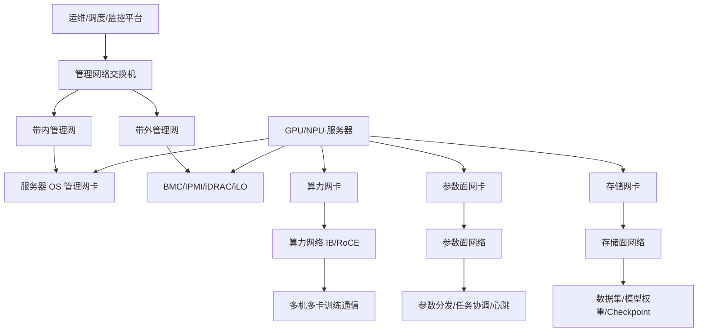
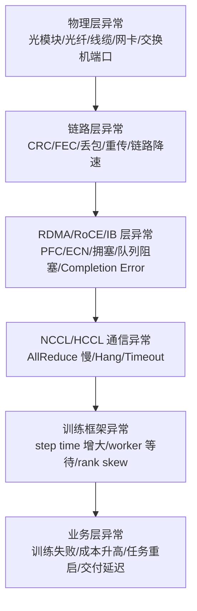
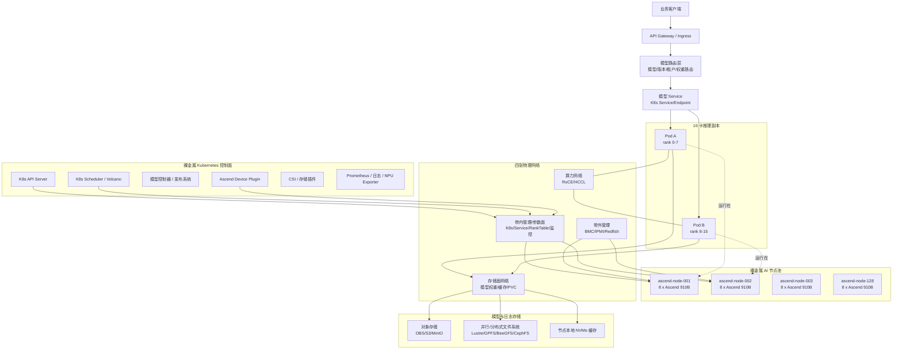
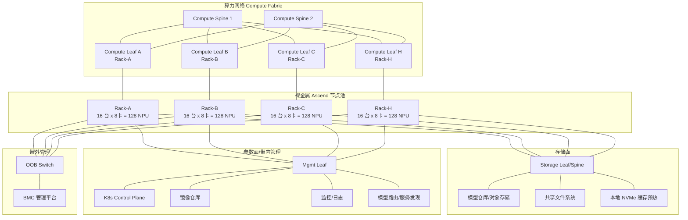
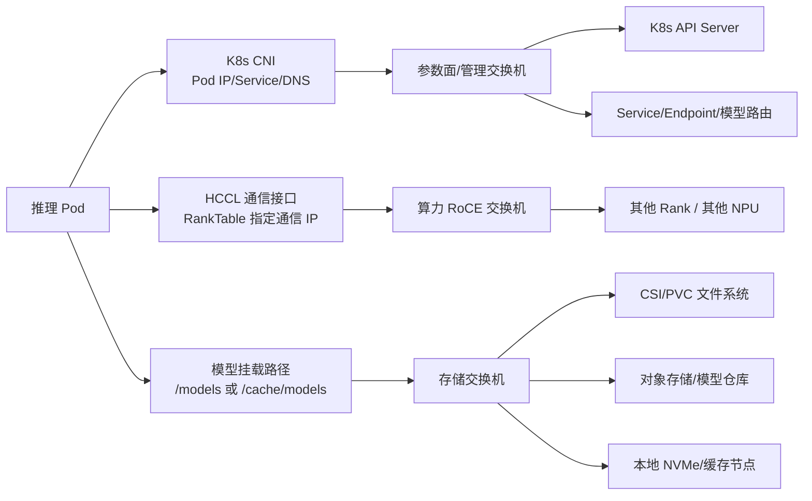
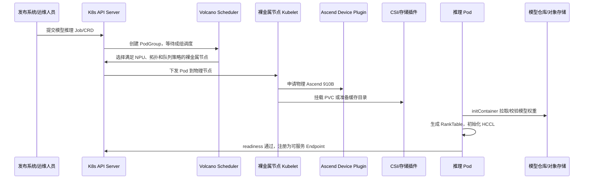
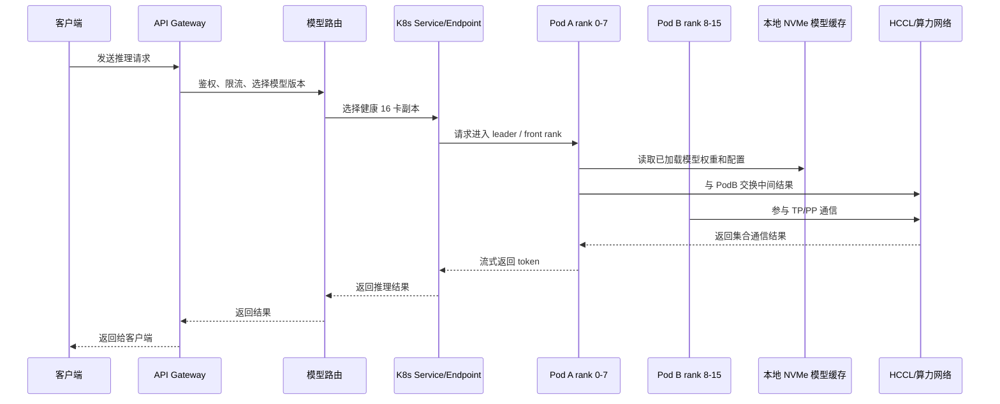

# AI 智算中心网络与故障传导路径分析

> 内部分享材料：面向没有 AI 集群、分布式训练、RDMA 网络基础的团队成员。
> 建议分享标题：**从一条坏光纤到千卡训练降速：AI 智算中心网络故障如何传导**

---

## 目录

1. [分享目标](#分享目标)
2. [先建立整体认知：智算中心是什么](#先建立整体认知智算中心是什么)
3. [基础名词解释](#基础名词解释)
4. [智算中心四张网：怎么分、怎么互联](#智算中心四张网怎么分怎么互联)
5. [大模型训练为什么特别依赖网络](#大模型训练为什么特别依赖网络)
6. [核心故障传导模型](#核心故障传导模型)
7. [典型故障传导路径](#典型故障传导路径)
8. [排障方法：从训练现象到物理链路](#排障方法从训练现象到物理链路)
9. [监控指标与告警建议](#监控指标与告警建议)
10. [内部复盘模板](#内部复盘模板)
11. [分享案例](#分享案例)
12. [实际场景：基于 Ascend 910B 的千卡裸金属 Kubernetes 分布式推理集群](#实际场景基于-ascend-910b-的千卡裸金属-kubernetes-分布式推理集群)
13. [延伸阅读与实践材料](#延伸阅读与实践材料)
14. [一页总结](#一页总结)

---

## 分享目标

本次分享选取的方向是：**AI 智算中心网络故障传导路径分析**。

希望听众分享后能够回答以下问题：

- 智算中心为什么通常要拆分为算力网络、参数面网络、存储面网络、管理网络？
- 大模型训练中的 `step time`、`AllReduce`、`AllGather`、`checkpoint` 等词到底是什么意思？
- 为什么一条链路轻微丢包、一个光模块异常、一个慢 rank，可能拖慢整个千卡训练任务？
- 网络排障时应如何从训练日志一路定位到网卡、交换机端口、光模块或线缆？
- 团队应沉淀哪些监控指标、排障模板和复盘方法？

一句话主题：

> AI 网络故障不是“断了才算故障”，更常见的是“微丢包、微拥塞、微抖动”通过 RDMA 和集合通信被放大，最终表现为 GPU 空转、训练降速、任务 hang 或 timeout。

---

## 先建立整体认知：智算中心是什么

### AI 智算中心

**AI 智算中心**可以理解为专门为 AI 训练、推理、大模型应用建设的数据中心。

传统数据中心主要承载：

- Web 服务
- 数据库
- 虚拟机
- 普通容器
- 通用业务系统

AI 智算中心主要承载：

- 大模型预训练
- 大模型微调
- 多机多卡分布式训练
- GPU / NPU 推理服务
- 多租户 AI 平台
- 高性能数据处理和特征处理

一个典型 AI 智算中心通常包括：

```text
GPU / NPU 服务器
高速算力网络
参数面 / 控制面网络
高性能存储网络
带内 / 带外管理网络
训练框架
调度平台
监控告警平台
运维自动化平台
```

核心目标是：

```text
让大量昂贵的 GPU / NPU 稳定、高效、持续地工作。
```

### 为什么网络是智算中心的关键基础设施

大模型训练不是单台机器独立完成计算，而是大量 GPU / NPU 共同完成一个任务。

这意味着：

```text
GPU 需要算得快
GPU 之间也需要同步得快
数据需要供给得快
checkpoint 需要保存得快
调度和监控需要控制得稳
```

所以在 AI 智算中心里，网络不仅负责“能不能连通”，还直接决定：

- GPU 利用率
- 训练 step time
- tokens/sec
- checkpoint 耗时
- 分布式任务成功率
- 大规模任务的稳定性
- 推理服务尾延迟

---

## 基础名词解释

本章面向没有 AI 训练和高性能网络基础的同事，先把后文会出现的关键名词讲清楚。

### GPU / NPU

**GPU** 是图形处理器，现在被广泛用于 AI 训练和推理。
**NPU** 是神经网络处理器，通常指专门面向 AI 计算设计的加速芯片。

可以粗略类比：

```text
CPU：少量能力很强的通用工人，适合复杂逻辑和控制。
GPU / NPU：大量并行工人，适合矩阵计算、张量计算等重复计算。
```

大模型训练需要做大量矩阵乘法，所以非常适合 GPU / NPU。

### GPU 利用率

**GPU 利用率**表示 GPU 当前有多忙。

```text
GPU 利用率 95%：大部分时间都在计算。
GPU 利用率 30%：大量时间在等待。
```

GPU 利用率低不一定是 GPU 坏了，可能是：

- 数据加载慢
- 网络通信慢
- 某个节点拖后腿
- 存储读写慢
- checkpoint 卡住
- 程序出现同步等待

在网络故障场景中，常见传导是：

```text
网络通信变慢
=> GPU 等待其他 GPU
=> GPU 空转
=> GPU 利用率下降
=> 训练成本上升
```

### 模型训练

**模型训练**就是让模型通过大量数据不断调整参数，使输出越来越接近目标结果。

一个简化的训练流程：

```text
输入数据
=> 模型计算输出
=> 和正确答案比较
=> 计算 loss
=> 根据 loss 计算梯度
=> 根据梯度更新模型参数
=> 重复很多次
```

### 参数

**参数**是模型内部需要学习的数值。

常见说法：

```text
7B 模型：约 70 亿参数
70B 模型：约 700 亿参数
```

参数越多，模型通常越强，但同时带来：

- 显存占用更大
- 计算量更大
- 通信量更大
- checkpoint 更大
- 训练稳定性要求更高

### Batch

训练时不会每次只处理一条数据，而是一次处理一批数据，这一批数据叫 **batch**。

```text
batch size = 1024
```

表示一次训练计算处理 1024 条样本。

### Step / 训练步

**step** 是训练过程中的一次完整迭代。

一个 step 通常包括：

```text
读取一批数据
=> 前向传播
=> 计算 loss
=> 反向传播
=> 梯度同步
=> 更新参数
```

可以把 step 理解为训练任务向前推进的一小步。

### Training Step Time / 训练 Step Time

**训练 step time** 指完成一个训练 step 所花费的时间。

例如：

```text
step time = 2 秒
```

表示模型每完成一次参数更新需要 2 秒。

它是大模型训练里非常核心的性能指标。
如果 step time 从 2 秒变成 5 秒，说明训练速度明显下降。

step time 通常由几部分组成：

```text
step time =
数据读取时间
+ GPU 计算时间
+ GPU 间通信时间
+ 等待时间
+ checkpoint 或框架开销
```

网络故障常见影响：

```text
网络通信变慢
=> AllReduce / AllGather 变慢
=> 所有 GPU 等待
=> step time 增大
```

### Loss

**loss** 是模型预测结果和真实答案之间的差距。

```text
loss 越大：模型错得越多。
loss 越小：模型学得越好。
```

训练的目标就是让 loss 逐步下降。

### 前向传播 / Forward

**前向传播**是模型从输入数据计算输出结果的过程。

```text
输入一句话
=> 模型计算
=> 输出下一个词的概率
```

这是“算答案”的过程。

### 反向传播 / Backward

**反向传播**是根据 loss 计算每个参数应该如何调整的过程。

反向传播会产生一个关键对象：**梯度**。

### 梯度 / Gradient

**梯度**可以理解为参数调整方向。

如果参数是模型里的“旋钮”，梯度就是告诉系统：

```text
这个旋钮往哪个方向拧，拧多少。
```

多 GPU 训练时，每张 GPU 会算出自己的梯度，然后需要和其他 GPU 同步。
这就是大模型训练产生大量网络通信的核心原因之一。

### 分布式训练

**分布式训练**指用多台机器、多张 GPU / NPU 一起训练一个模型。

常见规模：

```text
单卡训练：1 张 GPU 训练
单机多卡训练：1 台服务器内 8 张 GPU 训练
多机多卡训练：多台服务器、几十张、几百张、几千张 GPU 一起训练
```

分布式训练的难点：

```text
大家要一起算，还要经常同步中间结果、梯度、参数和状态。
```

### Node / 节点

**节点**通常指一台服务器。

例如：

```text
gpu-node-001：一台 GPU 服务器
```

一台节点里可能包括：

- 8 张 GPU
- 多张高速网卡
- CPU
- 内存
- 本地 NVMe 磁盘
- BMC 管理口

### Worker

**worker** 是参与训练的一个工作进程。

例如：

```text
8 台服务器，每台 8 张 GPU
=> 可能有 64 个 worker
```

每个 worker 负责一部分计算。

### Rank

**rank** 是分布式训练中每个进程的编号。

可以理解为：

```text
rank = worker 的身份编号
```

例如一个 8 卡任务：

```text
rank 0
rank 1
rank 2
...
rank 7
```

排障时 rank 非常重要，因为日志里经常出现：

```text
rank 37 timeout
rank 128 communication error
```

我们需要建立映射：

```text
rank 37
=> 哪台服务器
=> 哪张 GPU
=> 哪张网卡
=> 哪个交换机端口
=> 哪条光纤 / 哪个光模块
```

### Straggler / 慢节点 / 慢 Rank

**straggler** 指拖慢整体任务的慢节点或慢 rank。

大规模训练中，很多通信操作要求所有 rank 一起完成。
如果 511 个 rank 很快，只有 1 个 rank 很慢，整体也会被这个慢 rank 拖住。

```text
一个 rank 网络慢
=> AllReduce 完成慢
=> 所有 rank 等它
=> 所有 GPU 空转
=> step time 变大
```

### 数据并行 / Data Parallel

**数据并行**是最常见的分布式训练方式。

做法：

```text
每张 GPU 拿不同的数据
每张 GPU 复制一份完整模型
各自计算梯度
然后同步梯度
```

例子：

```text
GPU 0 处理 batch A
GPU 1 处理 batch B
GPU 2 处理 batch C
GPU 3 处理 batch D
```

算完后需要同步梯度，确保模型参数一致。
数据并行最常见的通信操作是：**AllReduce**。

### 张量并行 / Tensor Parallel

**张量并行**是把模型中的大矩阵或大张量切分到多张 GPU 上。

为什么需要张量并行？

```text
模型太大，单张 GPU 放不下或算不过来。
```

张量并行通信非常频繁，对网络延迟和抖动更敏感。

常见通信操作：

- AllReduce
- AllGather
- ReduceScatter

### 流水线并行 / Pipeline Parallel

**流水线并行**是把模型不同层放在不同 GPU 或不同机器上。

例如：

```text
GPU 0：模型第 1-10 层
GPU 1：模型第 11-20 层
GPU 2：模型第 21-30 层
GPU 3：模型第 31-40 层
```

数据像流水线一样经过这些 GPU。

问题是：

```text
如果某个阶段慢，后面的阶段就要等。
```

### Pipeline Bubble / 流水线气泡

**pipeline bubble** 指流水线中某些 GPU 没活干、在等待的时间。

```text
GPU 0 正在算
GPU 1 等 GPU 0 的结果
GPU 2 等 GPU 1 的结果
```

等待时间就是 bubble。
网络变慢会导致 bubble 增加，训练吞吐下降。

### Collective / 集合通信

**collective communication** 是多个 GPU 或多个进程共同参与的通信操作。

常见集合通信：

- AllReduce
- AllGather
- ReduceScatter
- Broadcast
- Barrier

大模型训练高度依赖集合通信。
网络故障一旦影响集合通信，就可能影响整个训练任务。

### AllReduce

**AllReduce** 是分布式训练中最重要的通信操作之一。

它做两件事：

```text
Reduce：把多个 GPU 的数据合并，例如求和。
All：把合并结果再发给所有 GPU。
```

简单例子：

```text
GPU 0 的梯度 = 1
GPU 1 的梯度 = 2
GPU 2 的梯度 = 3
GPU 3 的梯度 = 4
```

AllReduce 求和后：

```text
总梯度 = 1 + 2 + 3 + 4 = 10
```

然后每张 GPU 都拿到 10：

```text
GPU 0 得到 10
GPU 1 得到 10
GPU 2 得到 10
GPU 3 得到 10
```

一句话：

> AllReduce 是“大家把结果汇总，再把汇总结果发给所有人”。

故障传导：

```text
某个 GPU / 节点网络慢
=> AllReduce 等它
=> 所有 GPU 同步变慢
=> step time 增大
```

### AllGather

**AllGather** 的含义是：

```text
每个 GPU 有一部分数据
AllGather 后，每个 GPU 都拿到所有人的数据
```

例子：

```text
GPU 0 有 A
GPU 1 有 B
GPU 2 有 C
GPU 3 有 D
```

AllGather 后：

```text
GPU 0 有 A+B+C+D
GPU 1 有 A+B+C+D
GPU 2 有 A+B+C+D
GPU 3 有 A+B+C+D
```

一句话：

> AllGather 是“每个人把自己的一份拿出来，最后所有人都拿到完整合集”。

### ReduceScatter

**ReduceScatter** 可以理解为 AllReduce 的一部分。

```text
先把多个 GPU 的数据合并
再把合并后的结果切片分给不同 GPU
```

一句话：

> ReduceScatter 是“先合并，再分发不同片段”。

### Broadcast

**Broadcast** 是广播。

```text
一个节点有数据
把这份数据发给所有其他节点
```

例如：

```text
rank 0 有模型参数
rank 0 把参数广播给所有 rank
```

### Barrier

**Barrier** 是同步屏障。

```text
所有 rank 都到达这个点之后，才能继续往下执行。
```

如果一个 rank 慢，其他 rank 都会等。

```text
一个 rank 卡住
=> barrier 无法通过
=> 整个任务看起来 hang
```

### Checkpoint

**checkpoint** 是训练过程中的模型保存点。

大模型训练通常要跑很久，如果中途机器故障或任务失败，不可能从头开始。
所以系统会定期保存当前训练状态。

checkpoint 通常包含：

- 模型参数
- 优化器状态
- 学习率状态
- 训练 step 编号
- 随机数状态
- 并行切分信息

保存 checkpoint 后，如果任务失败，可以从最近一次 checkpoint 恢复。

### Checkpoint Time

**checkpoint time** 是保存一次 checkpoint 所花费的时间。

大模型 checkpoint 可能非常大：

```text
几十 GB
几百 GB
甚至 TB 级别
```

checkpoint 写入慢会导致：

```text
训练暂停或等待
=> step time 出现尖刺
=> GPU 利用率下降
```

### NCCL

**NCCL** 是 NVIDIA Collective Communications Library，即 NVIDIA 集合通信库。

PyTorch、Megatron-LM、DeepSpeed 等训练框架底层经常使用 NCCL 完成：

- AllReduce
- AllGather
- Broadcast
- ReduceScatter

网络出问题时，训练日志中经常看到 NCCL 报错。

### NCCL Timeout

**NCCL timeout** 指 NCCL 通信超时。

典型原因：

- 某个 rank 挂了
- 某个节点网络异常
- RDMA 通信失败
- 交换机拥塞严重
- 某个 GPU 进程卡住
- 数据加载或计算严重不均衡

注意：

```text
NCCL timeout 通常是结果，不一定是根因。
```

### Hang

**hang** 指任务没有退出，但也不继续往前运行。

表现可能是：

- 日志不再刷新
- GPU 利用率下降
- step 不再增加
- 进程仍然存在
- 没有明确错误信息

分布式训练中，hang 常见原因是某些 rank 在等待其他 rank。

### RDMA

**RDMA** 是 Remote Direct Memory Access，远程直接内存访问。

普通网络通信通常需要 CPU 和操作系统协议栈深度参与：

```text
应用程序
=> 操作系统
=> CPU
=> 网卡
=> 网络
```

RDMA 可以让一台机器直接读写另一台机器的内存，减少 CPU 参与。

优势：

- 延迟低
- CPU 开销低
- 吞吐高

AI 训练大量使用 RDMA，是因为 GPU 之间需要高速交换数据。

### InfiniBand / IB

**InfiniBand** 是一种高性能网络技术，常用于高性能计算和 AI 训练集群。

特点：

- 极低延迟
- 高带宽
- 原生支持 RDMA
- 大规模训练中常见

### RoCE / RoCEv2

**RoCE** 是 RDMA over Converged Ethernet，即在以太网上跑 RDMA。
RoCEv2 是更常见版本，可以跨三层网络。

优点：

- 基于以太网生态
- 部署灵活
- 性能接近 RDMA 需求

难点：

- 对网络配置要求高
- 对拥塞控制敏感
- 对 PFC、ECN、队列、buffer 配置要求高

### NVLink / NVSwitch

**NVLink** 是 NVIDIA GPU 之间的高速互联技术，主要用于单机内部 GPU 通信。

**NVSwitch** 是更高级的 GPU 互联交换芯片，可以让一台服务器内多张 GPU 高效全互联。

可以简单理解：

```text
NVLink / NVSwitch：机内 GPU 高速路
IB / RoCE：机器之间 GPU 高速路
```

### 带宽

**带宽**表示单位时间内能传输多少数据。

常见速率：

```text
100Gbps
200Gbps
400Gbps
800Gbps
```

带宽越大，理论上传输大梯度、大张量、大 checkpoint 越快。

### 延迟

**延迟**是一次通信从发出到收到响应所需要的时间。

AI 训练既需要高带宽，也需要低延迟。

### 抖动

**抖动**指延迟不稳定。

```text
正常延迟：10 微秒
偶尔变成：500 微秒
```

AI 训练很怕抖动，因为集合通信往往由最慢 rank 决定。

### 丢包

**丢包**指网络包在传输过程中丢失。

在 RDMA、RoCE、分布式训练场景中，丢包可能导致：

- 重传
- 超时
- 通信失败
- NCCL 报错
- 训练 hang

### 重传

**重传**指网络包丢失或出错后重新发送。

重传会增加延迟，降低有效带宽。

```text
链路质量差
=> 丢包或错误
=> 重传增加
=> 通信变慢
=> AllReduce 变慢
=> step time 变大
```

### 尾延迟 / p95 / p99

**尾延迟**指最慢那部分请求或通信的延迟。

常用指标：

```text
p95
p99
p999
```

p99 延迟表示：

```text
99% 的请求都比这个值快
1% 的请求比这个值更慢
```

AI 训练特别关注尾延迟，因为集合通信由最慢 rank 决定。

### CRC Error

**CRC error** 是循环冗余校验错误。

可以理解为：

```text
网络包传输后，接收方发现数据可能坏了。
```

常见原因：

- 光模块质量差
- 光纤弯折
- 线缆松动
- 端口故障
- 网卡或交换机端口异常

### FEC

**FEC** 是 Forward Error Correction，前向纠错。

作用是：

```text
网络传输中出现少量错误时，接收方可以自动修正。
```

重要指标：

```text
FEC corrected：发生错误，但被修正了。
FEC uncorrected：错误太严重，无法修正。
```

FEC corrected 持续增长说明链路质量可能已经变差。
FEC uncorrected 出现通常更严重。

### PFC

**PFC** 是 Priority Flow Control，优先级流控。

它的作用：

```text
当交换机或网卡某个队列快塞满时，通知对端先别发了。
```

这个通知叫 pause frame。

PFC 的目标是避免丢包，但副作用是可能造成队头阻塞和拥塞扩散。

### Pause Frame

**pause frame** 是 PFC 发出的暂停帧。

含义：

```text
我这边快接收不过来了，你先暂停发送。
```

pause frame 大量增长通常说明存在拥塞或队列阻塞。

### ECN

**ECN** 是 Explicit Congestion Notification，显式拥塞通知。

作用：

```text
网络设备发现拥塞苗头时，给数据包打标记。
```

接收方或发送方看到 ECN 标记后，可以降低发送速率。

### DCQCN

**DCQCN** 是 Data Center Quantized Congestion Notification。

它是 RoCE 网络中常用的拥塞控制机制，可以理解为：

```text
根据 ECN 标记动态调节 RDMA 发送速率。
```

### Buffer Occupancy

**buffer occupancy** 指交换机缓存使用率。

缓存过高可能导致：

- 排队延迟增加
- PFC pause 触发
- 丢包
- 通信抖动

### Head-of-Line Blocking / 队头阻塞

**队头阻塞**指队列前面的数据被卡住，后面的数据即使本来可以走，也只能等待。

类比：

```text
高速收费站只有一个车道。
第一辆车出问题停住。
后面所有车都过不去。
```

在 RoCE + PFC 场景中，队头阻塞可能把一个小拥塞放大成大范围通信异常。

### Tokens/sec

**tokens/sec** 是大语言模型训练和推理中常见吞吐指标。

token 可以理解为模型处理文本的基本单位。
tokens/sec 表示每秒处理多少 token。

网络变慢会导致 GPU 等待，最终 tokens/sec 下降。

### MFU

**MFU** 是 Model FLOPs Utilization，模型浮点运算利用率。

它衡量模型训练实际用到了多少理论算力。

```text
MFU 越高，GPU 算力利用越充分。
MFU 越低，说明有大量算力浪费。
```

---

## 智算中心四张网：怎么分、怎么互联

智算中心通常不是“一张大网跑所有流量”，而是按流量类型拆成多张逻辑或物理网络：

```text
1. 算力网络
2. 参数面网络
3. 存储面网络
4. 带内 / 带外管理网络
```

核心原则：

> 训练通信、参数同步、数据读写、运维管理要隔离，避免互相抢带宽、互相影响、互相放大故障。

### 四张网总览

| 网络 | 核心用途 | 典型流量 | 关键指标 | 隔离建议 |
|---|---|---|---|---|
| 算力网络 | GPU / NPU 间训练通信 | AllReduce、AllGather、ReduceScatter | 延迟、抖动、RDMA 错误、PFC、带宽 | 强隔离 |
| 参数面网络 | 任务控制、参数同步、训练协调 | 参数分发、worker 心跳、RPC | 稳定性、连接成功率、时延 | 隔离 |
| 存储面网络 | 数据集和 checkpoint 访问 | 读数据、写 checkpoint、加载模型 | 吞吐、IOPS、元数据延迟 | 隔离 |
| 带内管理网络 | OS 运维、调度、监控 | SSH、K8s、Slurm、日志、监控 | 可达性、控制面延迟 | 隔离 |
| 带外管理网络 | 硬件救援和电源管理 | IPMI、Redfish、BMC | 可达性、安全性 | 强隔离 |

> 这里把管理网络拆成带内和带外，所以表格中是五类，但通常仍统称为“四张网”：算力、参数面、存储面、管理面。

### 1. 算力网络

**算力网络**是 GPU / NPU 之间进行高速计算通信的网络。

它主要服务于大模型训练中的高频通信：

- AllReduce
- AllGather
- ReduceScatter
- Tensor Parallel 通信
- Pipeline Parallel 通信
- GPU / NPU 间高速数据交换

可以理解为：

> 算力网络是“训练任务内部的高速协同网络”。

常见技术：

| 技术 | 说明 |
|---|---|
| NVLink / NVSwitch | 单机内 GPU 高速互联 |
| InfiniBand | 多机训练常用，高性能 RDMA 网络 |
| RoCEv2 | 基于以太网的 RDMA 网络 |
| HCCS / Scale-up Fabric | 部分 NPU / AI 芯片内部互联技术 |

流量特点：

- 带宽极高
- 延迟敏感
- 抖动敏感
- 对丢包极其敏感
- 很怕慢节点

典型故障影响：

```text
算力网络抖动
=> NCCL / HCCL 通信变慢
=> AllReduce 卡住
=> step time 增大
=> GPU 利用率下降
=> 训练任务 timeout / hang
```

### 2. 参数面网络

**参数面网络**用于承载训练任务中的参数、梯度、模型状态、控制协调等流量。

不同厂商或不同架构中，“参数面网络”的定义可能略有差异。
在本材料中可以按大模型训练场景理解为：

> 参数面网络是“训练框架和分布式任务之间同步模型状态、参数状态、控制信息的网络”。

它不一定等同于最底层 GPU 间通信网络。

参数面可能承载：

- 模型参数分发
- optimizer state 同步
- parameter server 流量
- rank 初始化信息
- 分布式训练控制信息
- 训练任务心跳
- worker 注册与发现
- 弹性训练控制流量

算力网络和参数面网络的区别：

| 对比项 | 算力网络 | 参数面网络 |
|---|---|---|
| 主要对象 | GPU / NPU 间高速通信 | 训练进程、参数服务、控制组件 |
| 典型流量 | AllReduce、AllGather | 参数分发、状态同步、任务协调 |
| 性能要求 | 极高带宽、极低延迟 | 稳定性、可靠性、一定带宽 |
| 常见协议 | IB、RoCE、NCCL / HCCL | TCP/IP、RoCE、RPC、gRPC 等 |
| 故障表现 | step time 上升、NCCL timeout | worker 失联、参数同步慢、任务调度异常 |

典型故障影响：

```text
参数面网络异常
=> worker 状态同步失败
=> rank 初始化失败
=> 参数分发变慢
=> 训练启动慢或启动失败
=> 任务运行中 worker 掉线
```

如果参数面和算力网络混跑，还可能出现：

```text
参数同步流量抢占算力网络带宽
=> collective 通信变慢
=> 训练吞吐下降
```

### 3. 存储面网络

**存储面网络**用于连接计算节点和存储系统。

训练和推理都离不开存储，包括：

- 训练数据集读取
- checkpoint 保存
- checkpoint 恢复
- 模型权重加载
- 日志写入
- 样本缓存
- 特征数据读取

可以理解为：

> 存储面网络是“GPU 服务器访问数据和模型文件的网络”。

常见存储类型：

| 存储类型 | 说明 |
|---|---|
| 并行文件系统 | Lustre、GPFS、BeeGFS |
| 分布式文件系统 | CephFS、JuiceFS 等 |
| 对象存储 | S3、OBS、MinIO |
| 本地 NVMe 缓存 | 节点本地高速缓存 |
| 高性能 NAS | 共享文件存储 |

典型流量：

```text
训练开始：读取训练数据、加载初始权重
训练过程中：周期性读取 batch、保存 checkpoint、写训练日志
任务恢复：读取最近 checkpoint、恢复模型和优化器状态
```

典型故障影响：

```text
存储面网络慢
=> 数据加载慢
=> GPU 等数据
=> GPU 利用率下降
```

或：

```text
checkpoint 写入慢
=> 训练周期性暂停
=> step time 出现尖刺
```

严重时：

```text
checkpoint 保存失败
=> 任务失败后无法恢复
=> 训练损失扩大
```

### 4. 带内 / 带外管理网络

管理网络通常分为：

```text
带内管理网络
带外管理网络
```

#### 带内管理网络

**带内管理网络**是通过服务器正常业务网卡访问操作系统和管理服务的网络。

常见用途：

- SSH 登录服务器
- Kubernetes / Slurm 管理
- 容器镜像拉取
- 日志采集
- 监控指标上报
- Agent 心跳
- 软件部署
- 任务调度控制

可以理解为：

> 带内管理网络是“系统正常运行时的运维控制网络”。

#### 带外管理网络

**带外管理网络**独立于服务器操作系统和业务网络，通常连接 BMC / IPMI / iDRAC / iLO 等硬件管理口。

常见用途：

- 远程开关机
- 远程重启
- 查看硬件状态
- 查看电源、风扇、温度
- 远程挂载 ISO
- BIOS / 固件配置
- 操作系统故障时救援

可以理解为：

> 带外管理网络是“机器死机后还能救它的网络”。

带内和带外区别：

| 对比项 | 带内管理 | 带外管理 |
|---|---|---|
| 依赖操作系统 | 依赖 | 不依赖 |
| 走什么口 | 普通业务网卡 | BMC 管理口 |
| 用途 | 日常运维、监控、调度 | 硬件级管理、救援 |
| OS 崩溃后可用吗 | 通常不可用 | 通常可用 |
| 典型工具 | SSH、K8s、Prometheus | IPMI、Redfish、iDRAC、iLO |

### 四张网怎么互联

推荐理解：四张网不是全部互通，而是**受控互联**。

```text
算力网络：尽量封闭，只服务训练通信
参数面网络：和调度、训练框架受控互通
存储面网络：计算节点和存储集群互通
管理网络：运维平台和节点管理口互通
```

典型拓扑：

```text
                 运维平台 / 调度平台 / 监控平台
                          |
                    管理网络交换机
                    /            \
           带内管理网             带外管理网
              |                      |
        服务器 OS 网卡          BMC / IPMI 口
              |
------------------------------------------------
              |
          GPU / NPU 服务器
        /        |          \
       /         |           \
算力网卡      参数面网卡      存储网卡
  |            |              |
算力网络     参数面网络       存储网络
  |            |              |
GPU集群通信   训练控制/参数同步  数据集/Checkpoint
```

也可以用下面的 Mermaid 图表示：



关键互联关系：

1. **计算节点是四张网的交汇点**
   一台 GPU 服务器通常同时接入算力、参数面、存储面、管理面。

2. **算力网络一般不直接连外部业务网**
   目的是避免安全风险、异常流量、广播扫描、普通业务流量影响 RDMA。

3. **参数面网络可与调度系统受控互通**
   通常通过路由器、防火墙、ACL、VRF 进行访问控制。

4. **存储面网络只开放给需要访问存储的节点**
   避免管理流量或普通业务流量冲击数据读取和 checkpoint。

5. **带外管理网络必须独立**
   只允许堡垒机、硬件管理平台、自动化装机平台访问。

设计原则：

1. 算力网络不要和存储、管理混跑。
2. RDMA 网络要重点关注无损、拥塞控制、队列隔离。
3. 存储面要避免 checkpoint 高峰冲击训练通信。
4. 管理面低带宽但必须高可靠。
5. 带外管理网必须安全隔离。
6. 四张网之间只做必要互通，通过 ACL / VRF / 防火墙控制。
7. 监控要按网络平面分别采集，不要只看一张总网络。
8. 排障时先判断异常属于哪个网络平面。

---

## 大模型训练为什么特别依赖网络

### 训练任务中的通信模式

大模型训练通常不是单个 GPU 单独计算，而是多个 GPU 按不同并行策略协同。

#### 数据并行中的网络依赖

数据并行中，每张 GPU 拿不同 batch，各自计算梯度，然后同步梯度。

核心通信：

```text
AllReduce
```

传导关系：

```text
某一张卡通信慢
=> 整个 AllReduce 等待
=> 所有 GPU step time 增大
=> GPU 利用率下降
```

#### 张量并行中的网络依赖

张量并行把一个大矩阵或大张量切分到多张 GPU。

核心通信：

```text
AllGather
ReduceScatter
AllReduce
```

特点：

- 通信频率高
- 对延迟敏感
- 对抖动敏感
- 更容易放大网络微故障

#### 流水线并行中的网络依赖

流水线并行把模型不同层放到不同 GPU 或不同机器。

核心通信：

```text
Send / Recv activation
Send / Recv gradient
```

故障影响：

```text
一个 pipeline stage 慢
=> 后续 stage 空等
=> bubble 增加
=> 整体吞吐下降
```

### 为什么“一个慢点”会拖慢全局

很多 collective 操作具有同步屏障特征。
它们不是“谁快谁先走”，而是“大家一起完成才能继续”。

训练 step 时间可简化理解为：

```text
step_time = compute_time + communication_time + waiting_time
```

当一个 rank 变慢时：

```text
waiting_time ~= max(rank_i_time) - avg(rank_time)
```

也就是说：

> 大规模训练不是平均网络性能决定速度，而是最慢节点、最慢链路、最慢 rank 决定速度。

---

## 核心故障传导模型

AI 训练网络故障常见传导路径：



可以用一句话总结：

> 物理层和网络层的微小异常，会通过 RDMA 和集合通信放大，最终在训练层表现为最慢 rank 拖慢所有 GPU。

---

## 典型故障传导路径

### 路径一：光模块 / 光纤质量问题导致训练变慢

#### 传导链路

```text
光模块老化 / 光纤弯折 / 接头污染
=> CRC error / FEC corrected 增多
=> 链路重传或有效带宽下降
=> NCCL AllReduce 延迟升高
=> 单 step 时间变长
=> GPU 利用率下降
```

#### 典型表现

- 训练没有直接失败，但速度变慢
- 某几台机器 GPU 利用率周期性下降
- NCCL 日志出现通信耗时异常
- 交换机端口 CRC / FEC 计数持续增长

#### 排查指标

| 层级 | 指标 |
|---|---|
| 交换机端口 | CRC error、symbol error、FEC corrected / uncorrected |
| 网卡 | rx_errors、tx_errors、pause frame |
| NCCL | AllReduce latency、timeout、retry |
| 训练任务 | step time、GPU util、MFU |

#### 排查步骤与命令

> 说明：交换机命令会因厂商不同而不同，下面用通用写法表示。实际落地时需要替换为本厂商 CLI，例如 `show interface ...`、`display interface ...`、`net show interface ...` 等。

1. **先从训练日志定位慢 rank 和异常时间段**

   ```bash
   # 查看 NCCL / 通信相关日志
   rg -n "NCCL|AllReduce|AllGather|timeout|NET/IB|WARN|ERROR|rank" /path/to/train.log

   # 如果日志很多，先按异常时间窗口过滤
   rg -n "2026-05-11 09:|timeout|rank 327|NET/IB" /path/to/train.log
   ```

   要确认：

   ```text
   哪个 rank 最先报错或最慢
   异常是否集中在固定 rank
   异常发生时间是否与 step time 尖刺一致
   ```

2. **建立 rank 到主机、GPU、网卡的映射**

   ```bash
   # 在训练进程所在容器或节点内查看 rank 相关环境变量
   env | sort | rg "RANK|WORLD_SIZE|LOCAL_RANK|MASTER|NCCL"

   # Kubernetes 场景：查看 pod 落在哪台节点
   kubectl get pod -n <namespace> -o wide | rg "<job-name>|<pod-name>"

   # Slurm 场景：查看任务节点分配
   scontrol show job <job_id>
   scontrol show hostnames <nodelist>
   ```

   目标是得到：

   ```text
   rank 327 => gpu-node-041 => GPU 7 => mlx5_1 / ensXfY => switch port Ethernet1/17
   ```

3. **在异常主机上检查网卡和链路状态**

   ```bash
   # 查看网卡基础状态和速率
   ip -br link
   ethtool <nic>

   # 查看网卡错误计数
   ethtool -S <nic> | rg -i "err|crc|drop|discard|timeout|reset|pause|fec|symbol"

   # 连续观察错误计数是否增长
   watch -n 5 'ethtool -S <nic> | egrep -i "err|crc|drop|discard|pause|fec|symbol"'
   ```

   重点看：

   ```text
   rx_errors / tx_errors 是否增长
   crc / symbol error 是否增长
   link speed 是否低于预期
   pause frame 是否异常增长
   ```

4. **检查 IB / RDMA 设备状态**

   ```bash
   # IB / RDMA 设备和端口状态
   ibstat
   ibv_devinfo
   rdma link

   # 网卡到 RDMA 设备映射，常见于 Mellanox / NVIDIA 网卡
   ibdev2netdev -v

   # IB 环境可查看端口性能计数器
   perfquery
   ```

   重点看：

   ```text
   State 是否 Active
   Physical state 是否 LinkUp
   Rate 是否符合预期
   SymbolErrorCounter、LinkErrorRecoveryCounter、VL15Dropped 是否异常
   ```

5. **在交换机侧检查对应端口**

   ```text
   show interface ethernet <port>
   show interface ethernet <port> counters errors
   show interface ethernet <port> transceiver
   show interface ethernet <port> fec
   show interface ethernet <port> status
   ```

   重点看：

   ```text
   CRC error 是否增长
   FEC corrected / uncorrected 是否增长
   光模块收发光功率是否越界
   端口是否发生 flap
   端口速率是否降速
   ```

6. **做处理前后对比**

   ```text
   更换光模块 / 光纤 / 端口前记录一次计数器
   清零或记录当前基线
   更换后继续跑 NCCL test 或训练任务
   观察 CRC / FEC / step time 是否恢复
   ```

   可用于验证的命令：

   ```bash
   # NCCL tests 示例，具体参数按集群规模调整
   all_reduce_perf -b 8M -e 8G -f 2 -g <gpus_per_node>

   # 观察 GPU 利用率是否恢复
   nvidia-smi dmon -s pucm
   ```

#### 误判风险

这类问题容易被误判为：

```text
模型代码慢
数据加载慢
GPU 故障
训练框架问题
```

但根因可能只是某条光纤、某个光模块或某个端口质量差。

### 路径二：RoCE 无损网络配置不当导致 PFC 风暴

RoCEv2 依赖以太网实现 RDMA。为了降低丢包，通常会使用：

- PFC：Priority Flow Control
- ECN：Explicit Congestion Notification
- DCQCN：Data Center Quantized Congestion Notification

#### 传导链路

```text
某条链路拥塞
=> PFC pause frame 触发
=> 上游端口暂停发送
=> 暂停信号继续向上游扩散
=> 多个队列被阻塞
=> RDMA 通信延迟飙升
=> NCCL collective hang
=> 训练任务 timeout
```

PFC 的危险点在于它不是只影响一个流，而是可能阻塞整个优先级队列。

```text
一个热点流
=> 阻塞一个队列
=> 影响同队列其他正常流
=> 形成 head-of-line blocking
```

#### 典型表现

- 多个训练任务同时变慢
- 网络没有明显断链
- ping 可能正常
- RDMA 性能测试异常
- 交换机 pause frame 暴增
- 某些端口 buffer 使用率高

#### 排查重点

| 指标 | 含义 |
|---|---|
| PFC pause frames | 是否发生无损流控 |
| ECN marked packets | 是否有拥塞标记 |
| buffer occupancy | 交换机缓存是否被打满 |
| RDMA retransmission / error | RDMA 是否出现重传或错误 |
| NCCL timeout | collective 是否超时 |

#### 排查步骤与命令

1. **确认是否是多任务、多节点同时异常**

   ```bash
   # 从训练日志中统计 timeout / NCCL error 是否集中爆发
   rg -n "NCCL|timeout|NET/IB|transport error|ibv_poll_cq" /path/to/jobs/*/*.log

   # Kubernetes 场景查看近期任务事件
   kubectl get events -A --sort-by=.lastTimestamp | tail -n 50

   # Slurm 场景查看任务状态
   squeue
   sacct -j <job_id> --format=JobID,State,Elapsed,NodeList%80
   ```

   判断：

   ```text
   如果多个任务、多个节点、同一时间段一起变慢，更像 fabric 拥塞或 PFC 扩散。
   如果只有单个 rank 异常，更像单点链路、网卡或主机问题。
   ```

2. **主机侧检查 PFC / pause / RDMA 错误**

   ```bash
   # 查看网卡 pause、丢包、错误、拥塞相关计数
   ethtool -S <nic> | rg -i "pause|pfc|ecn|cnp|cong|drop|discard|err|timeout|prio"

   # 连续观察 pause / pfc / cnp 是否增长
   watch -n 5 'ethtool -S <nic> | egrep -i "pause|pfc|ecn|cnp|cong|drop|discard|err"'

   # 查看 RDMA link
   rdma link
   ```

   常见关注点：

   ```text
   rx_prio*_pause / tx_prio*_pause 是否增长
   CNP / ECN 相关计数是否增长
   drop / discard 是否增长
   RDMA completion error 是否出现
   ```

3. **交换机侧检查 PFC、ECN、buffer、队列**

   ```text
   show interface ethernet <port> priority-flow-control
   show interface ethernet <port> counters pfc
   show interface ethernet <port> counters queue
   show interface ethernet <port> counters ecn
   show interface ethernet <port> buffer
   show qos interface ethernet <port>
   ```

   重点看：

   ```text
   PFC pause frame 是否在某些端口暴增
   ECN marked packets 是否异常增长
   buffer occupancy 是否长期高水位
   某个 lossless priority 队列是否持续拥塞
   pause 是否从下游向上游扩散
   ```

4. **检查 RoCE 无损配置是否一致**

   ```bash
   # 主机侧查看 DCB / PFC / ETS 配置，命令可因系统不同而不同
   dcbtool gc <nic> pfc
   dcbtool gc <nic> app
   lldptool -t -i <nic> -V PFC
   lldptool -t -i <nic> -V ETS-CFG
   ```

   需要确认：

   ```text
   主机和交换机 PFC priority 是否一致
   RoCE 流量是否打到正确 DSCP / PCP
   lossless 队列是否只承载 RDMA 流量
   ECN 阈值是否合理
   DCQCN 参数是否符合厂商建议
   ```

5. **用 RDMA / NCCL 压测复现**

   ```bash
   # RDMA 带宽测试，服务端
   ib_write_bw -d <ib_dev> -i <port>

   # RDMA 带宽测试，客户端
   ib_write_bw -d <ib_dev> -i <port> <server_ip>

   # NCCL AllReduce 测试
   all_reduce_perf -b 8M -e 8G -f 2 -g <gpus_per_node>
   ```

   验证方法：

   ```text
   压测期间同步观察 PFC / ECN / buffer / queue counters
   如果压测一启动 pause 和 buffer 就暴涨，说明拥塞控制或队列配置有问题
   ```

内部分享重点：

> RoCE 网络里最危险的不是简单丢包，而是 PFC 传播 + 队头阻塞 + collective 同步放大。

### 路径三：单节点慢导致整个训练任务被拖慢

#### 传导链路

```text
某台服务器网络慢
=> 该 rank 参与 AllReduce 变慢
=> 所有 rank 等它
=> 整个 step 被拉长
=> 集群 GPU 同时空转
```

#### 典型表现

- 大部分 GPU 利用率呈锯齿状
- 某个 rank 日志明显落后
- step time p99 明显升高
- 训练吞吐下降，但没有立即失败

#### 排查方法

按 rank 维度采集：

```text
rank_id
hostname
GPU id
step time
通信耗时
数据加载耗时
GPU util
NIC counters
switch port counters
```

目标是找出：

```text
straggler rank
```

#### 排查步骤与命令

1. **从训练指标中找出慢 rank**

   ```bash
   # 搜索每个 rank 的 step time、通信耗时或 timeout
   rg -n "rank|step time|iter time|AllReduce|AllGather|timeout" /path/to/train.log

   # 如果框架会输出 rank 维度指标，可按 rank 聚合分析
   rg -n "rank [0-9]+.*(step|time|all_reduce|all_gather)" /path/to/train.log
   ```

   重点判断：

   ```text
   慢 rank 是否固定
   慢 rank 是否总在同一台 host
   慢 rank 是否只在 checkpoint 或数据加载阶段变慢
   ```

2. **查看异常节点 GPU 是否真的在等**

   ```bash
   # GPU 实时利用率、显存、功耗
   nvidia-smi
   nvidia-smi dmon -s pucm

   # 查看 GPU 拓扑，确认 GPU 和网卡亲和性
   nvidia-smi topo -m
   ```

   常见现象：

   ```text
   多数 GPU util 同时下降，说明可能在等同步。
   单节点 GPU util 异常，可能是该节点计算、数据、网络或进程问题。
   ```

3. **检查异常节点 CPU、内存、磁盘、数据加载是否拖后腿**

   ```bash
   top
   free -h
   vmstat 1
   iostat -xz 1
   pidstat -dru 1
   ```

   如果发现：

   ```text
   CPU 长时间打满
   iowait 高
   本地盘延迟高
   DataLoader 进程异常
   ```

   则慢 rank 不一定是网络问题，需要继续区分计算、数据和网络瓶颈。

4. **检查异常节点网卡和 RDMA**

   ```bash
   ip -br link
   ethtool <nic>
   ethtool -S <nic> | rg -i "err|drop|discard|pause|timeout|reset|crc|fec"
   rdma link
   ibstat
   ibdev2netdev -v
   ```

   重点看：

   ```text
   异常节点是否有错误计数增长
   是否发生链路降速
   是否只有某张网卡异常
   ```

5. **对比正常节点和异常节点**

   ```bash
   # 正常节点和异常节点分别执行同一组命令，对比输出
   ethtool -S <nic> | rg -i "err|drop|discard|pause|crc|fec"
   nvidia-smi dmon -s pucm
   iostat -xz 1
   ```

   对比维度：

   ```text
   GPU util
   NIC error counters
   RDMA state
   CPU iowait
   本地盘延迟
   数据加载耗时
   ```

6. **做节点隔离验证**

   ```text
   将异常节点从训练任务中摘除或替换
   使用相同任务规模重新运行
   如果 step time 恢复，说明慢点与该节点强相关
   如果问题迁移到其他节点，需要继续看 fabric 或任务本身
   ```

### 路径四：存储面网络拥塞导致 GPU 等数据

#### 传导链路

```text
存储面网络拥塞
=> batch 数据读取慢
=> DataLoader 队列供给不足
=> GPU 等数据
=> GPU 利用率下降
=> tokens/sec 下降
```

#### 典型表现

- GPU 利用率下降
- NCCL 日志可能没有明显异常
- step time 增大但通信耗时不一定增加
- 数据加载时间增加
- 存储吞吐或元数据延迟异常

#### 排查重点

- 数据加载耗时
- 训练节点到存储节点的网络吞吐
- 存储客户端错误
- 文件系统元数据服务延迟
- checkpoint 与数据读取是否抢占同一存储通道

#### 排查步骤与命令

1. **先区分是通信慢还是数据加载慢**

   ```bash
   # 搜索训练日志中的 data time、loader time、step time
   rg -n "data time|dataloader|load data|input time|step time|iter time" /path/to/train.log

   # 搜索 NCCL 错误，确认是否同时存在通信异常
   rg -n "NCCL|AllReduce|AllGather|timeout|NET/IB" /path/to/train.log
   ```

   判断：

   ```text
   data time 上升、NCCL 正常：优先排查存储和数据加载。
   communication time 上升、NCCL 异常：优先排查算力网络。
   两者都上升：检查存储面和算力面是否混跑或共同拥塞。
   ```

2. **训练节点侧检查磁盘和网络**

   ```bash
   # 磁盘 I/O 和 iowait
   iostat -xz 1
   vmstat 1

   # 进程级 I/O
   pidstat -d 1

   # 存储网卡吞吐和错误
   ip -s link show <storage_nic>
   ethtool -S <storage_nic> | rg -i "err|drop|discard|timeout|reset|pause"
   ```

   重点看：

   ```text
   训练节点是否在等 I/O
   存储网卡是否打满
   存储网卡是否有 drop / error
   ```

3. **检查挂载和文件系统客户端状态**

   ```bash
   # 查看挂载点和文件系统类型
   mount | rg "<dataset_mount>|lustre|nfs|ceph|bee|juice"
   df -h

   # 查看客户端日志
   dmesg -T | rg -i "nfs|lustre|ceph|timeout|stale|reset|io error"
   journalctl -k --since "1 hour ago" | rg -i "nfs|lustre|ceph|timeout|io error"
   ```

   常见异常：

   ```text
   NFS timeout
   Lustre reconnect
   Ceph slow request
   metadata server timeout
   stale file handle
   ```

4. **做读吞吐基准测试**

   ```bash
   # 简单顺序读测试，避免写入破坏数据
   dd if=/path/to/dataset/sample.bin of=/dev/null bs=1M count=4096 iflag=direct status=progress

   # fio 读测试示例，注意选择测试目录和只读参数
   fio --name=readtest --directory=/path/to/dataset \
     --rw=read --bs=1M --size=8G --numjobs=4 --iodepth=16 \
     --direct=1 --runtime=60 --time_based --group_reporting
   ```

   验证：

   ```text
   与历史基线或正常节点对比
   如果单节点读吞吐低，继续看该节点链路和挂载
   如果所有节点都低，继续看存储集群或存储网络
   ```

5. **存储服务端 / 存储网络侧检查**

   ```text
   # 命令因存储系统不同而不同，重点检查：
   存储节点网卡吞吐和错误
   存储服务端磁盘延迟
   元数据服务 CPU / 内存 / 请求延迟
   客户端连接数和慢请求
   ```

   常见系统示例：

   ```bash
   # Ceph 示例
   ceph -s
   ceph health detail
   ceph osd perf

   # NFS 服务端示例
   nfsstat -s
   ```

### 路径五：checkpoint 写入慢导致周期性 step time 尖刺

#### 传导链路

```text
checkpoint 文件很大
=> 多节点同时写存储
=> 存储面网络和后端存储拥塞
=> checkpoint time 增大
=> 训练周期性暂停
=> step time 出现尖刺
```

#### 典型表现

- 每隔固定 step 出现一次明显卡顿
- checkpoint time 增长
- GPU 利用率周期性下降
- 存储写带宽打满
- 元数据服务压力升高

#### 排查重点

- checkpoint 大小
- checkpoint 频率
- 保存策略：集中写、分片写、异步写
- 存储面网络吞吐
- 存储系统 IOPS 和元数据延迟

#### 排查步骤与命令

1. **确认 step time 尖刺是否与 checkpoint 时间对齐**

   ```bash
   # 搜索 checkpoint 保存日志
   rg -n "checkpoint|ckpt|save model|saving|saved|state_dict" /path/to/train.log

   # 同时搜索 step time
   rg -n "step time|iter time|tokens/sec|throughput" /path/to/train.log
   ```

   判断：

   ```text
   如果每次 save checkpoint 前后 step time 都尖刺，优先排查 checkpoint。
   如果尖刺没有周期性，需继续排查网络抖动、慢 rank 或数据加载。
   ```

2. **统计 checkpoint 大小和文件数量**

   ```bash
   # 查看 checkpoint 目录大小
   du -sh /path/to/checkpoints/*

   # 统计文件数量，文件过多会放大元数据压力
   find /path/to/checkpoints/<ckpt_dir> -type f | wc -l

   # 查看最近写入时间
   ls -lhtr /path/to/checkpoints | tail
   ```

   重点看：

   ```text
   单次 checkpoint 总大小
   文件数量是否过多
   是否所有 rank 同时写同一目录
   是否存在小文件风暴
   ```

3. **训练节点侧观察写入和网络**

   ```bash
   # checkpoint 期间观察磁盘和 iowait
   iostat -xz 1
   vmstat 1

   # 观察进程级写入
   pidstat -d 1

   # 观察存储网卡吞吐和错误
   ip -s link show <storage_nic>
   ethtool -S <storage_nic> | rg -i "err|drop|discard|pause|timeout|reset"
   ```

4. **做写入基准测试**

   > 注意：写测试必须选择临时目录，避免覆盖训练数据或已有 checkpoint。

   ```bash
   mkdir -p /path/to/checkpoints/.write-test

   fio --name=writetest --directory=/path/to/checkpoints/.write-test \
     --rw=write --bs=1M --size=8G --numjobs=4 --iodepth=16 \
     --direct=1 --runtime=60 --time_based --group_reporting
   ```

   测完清理：

   ```bash
   rm -rf /path/to/checkpoints/.write-test
   ```

5. **检查存储服务端和元数据压力**

   ```text
   关注：
   写吞吐是否打满
   后端磁盘延迟是否升高
   元数据服务是否高 CPU 或高延迟
   是否出现慢请求、锁等待、目录热点
   ```

   Ceph 示例：

   ```bash
   ceph -s
   ceph health detail
   ceph osd perf
   ```

6. **验证优化措施**

   ```text
   降低 checkpoint 频率
   错峰保存 checkpoint
   使用分片 checkpoint
   使用异步 checkpoint
   将数据读取和 checkpoint 写入拆到不同存储路径或网络平面
   ```

   验证指标：

   ```text
   checkpoint time 是否下降
   step time 尖刺是否消失
   存储写带宽是否更平滑
   GPU util 是否更稳定
   ```

### 路径六：管理网络异常导致调度和监控失真

#### 传导链路

```text
带内管理网络异常
=> agent 心跳丢失
=> 调度系统误判节点异常
=> 任务被驱逐 / 重启 / 标记失败
=> 训练中断
```

或：

```text
带外管理网络异常
=> 节点死机后无法远程重启
=> 故障恢复时间拉长
```

#### 排查重点

- 调度平台事件
- agent 心跳
- SSH / API 可达性
- 监控数据是否缺失
- BMC / Redfish / IPMI 可达性

#### 排查步骤与命令

1. **确认调度层是否误判节点异常**

   Kubernetes 场景：

   ```bash
   kubectl get nodes -o wide
   kubectl describe node <node>
   kubectl get events -A --sort-by=.lastTimestamp | tail -n 100
   kubectl get pods -A -o wide | rg "<node>|<job-name>"
   ```

   Slurm 场景：

   ```bash
   sinfo -Nel
   scontrol show node <node>
   squeue -w <node>
   sacct -j <job_id> --format=JobID,State,ExitCode,NodeList%80
   ```

   重点看：

   ```text
   NodeReady 是否变化
   节点是否被 drain / down
   任务是否被驱逐、重启、requeue
   事件时间是否与训练异常时间一致
   ```

2. **检查带内管理网络连通性**

   ```bash
   # 从运维节点或调度节点测试
   ping -c 5 <node_mgmt_ip>
   mtr -rwzc 20 <node_mgmt_ip>

   # 检查常用端口
   nc -vz <node_mgmt_ip> 22
   nc -vz <node_mgmt_ip> <agent_port>
   ```

   节点侧检查：

   ```bash
   ip addr
   ip route
   ip -s link show <mgmt_nic>
   ethtool <mgmt_nic>
   ethtool -S <mgmt_nic> | rg -i "err|drop|discard|timeout|reset"
   ```

3. **检查 agent / kubelet / slurmd / 监控进程**

   ```bash
   # Kubernetes 节点
   systemctl status kubelet
   journalctl -u kubelet --since "1 hour ago"

   # Slurm 节点
   systemctl status slurmd
   journalctl -u slurmd --since "1 hour ago"

   # 监控 agent 示例
   systemctl status node_exporter
   journalctl -u node_exporter --since "1 hour ago"
   ```

   重点看：

   ```text
   心跳是否超时
   证书或认证是否异常
   agent 是否重启
   是否因为管理网络抖动导致连接断开
   ```

4. **检查带外管理网络和 BMC**

   ```bash
   # IPMI 示例
   ipmitool -I lanplus -H <bmc_ip> -U <user> chassis status
   ipmitool -I lanplus -H <bmc_ip> -U <user> sensor

   # Redfish 示例
   curl -k -u <user>:<password> https://<bmc_ip>/redfish/v1/Systems/
   ```

   重点看：

   ```text
   BMC 是否可达
   是否能读取电源、温度、风扇、硬件告警
   OS 不可达时是否还能通过 BMC 重启或采集信息
   ```

5. **确认监控数据是否缺失或延迟**

   ```text
   在 Prometheus / 监控平台中检查：
   up 指标是否为 0
   scrape_duration 是否升高
   scrape_samples 是否突然下降
   节点指标是否出现断点
   ```

   PromQL 示例：

   ```promql
   up{instance="<node>:9100"}
   rate(node_network_receive_drop_total{instance="<node>:9100"}[5m])
   rate(node_network_transmit_drop_total{instance="<node>:9100"}[5m])
   ```

---

## 排障方法：从训练现象到物理链路

建议团队统一使用“四层定位法”。

### 第 1 层：业务现象

先看训练任务表现：

- 是否 hang
- 是否 timeout
- step time 是否变大
- GPU 利用率是否下降
- tokens/sec 是否下降
- 是否集中在某些节点
- 是否多个任务同时异常
- 是否和 checkpoint 时间点相关
- 是否和某个机柜、交换机、pod 相关

关键判断：

```text
是单任务异常，还是多任务同时异常？
是持续变慢，还是周期性尖刺？
是通信慢，还是数据读取慢？
```

### 第 2 层：训练框架 / NCCL

常用 NCCL 日志环境变量：

```bash
NCCL_DEBUG=INFO
NCCL_DEBUG_SUBSYS=INIT,NET,COLL
```

关注日志中的：

- rank 到 hostname 映射
- 使用的网卡
- collective 类型
- timeout 信息
- NET/IB 相关报错
- retry / connection reset
- 某个 rank 是否明显落后

典型 NCCL 报错关键词：

```text
unhandled system error
connection timed out
transport error
net/ib
ibv_poll_cq
remote access error
```

### 第 3 层：主机网络 / RDMA

常见检查命令：

```bash
ibstat
ibv_devinfo
rdma link
ethtool -S <nic>
```

关注：

- link state
- link speed
- rx_errors / tx_errors
- pause frames
- RDMA completion error
- retransmission
- packet drop
- 网卡是否降速

### 第 4 层：交换机 / Fabric

关注交换机侧：

- 端口 CRC
- FEC corrected / uncorrected
- PFC pause
- ECN mark
- buffer occupancy
- queue drop
- link flap
- port utilization
- hot spot
- 端口是否和异常节点对应

### 必须建立的映射关系

排障过程中最关键的是建立一条完整证据链：

```text
训练任务 ID
=> rank ID
=> hostname
=> GPU ID
=> NIC
=> switch
=> switch port
=> cable / transceiver
```

没有这条映射，就很容易停留在“某个 rank 慢了”，无法定位到实际可更换、可修复的物理对象。

---

## 监控指标与告警建议

### 训练任务侧

| 指标 | 含义 | 告警建议 |
|---|---|---|
| step time avg / p95 / p99 | 每步训练耗时 | 明显高于历史基线告警 |
| tokens/sec | 大模型吞吐 | 低于基线告警 |
| GPU util | GPU 利用率 | 持续低于任务基线告警 |
| MFU | 模型浮点利用率 | 持续下降需分析 |
| rank skew | rank 间耗时差异 | 差异过大定位 straggler |
| checkpoint time | 保存 checkpoint 耗时 | 超过基线或周期性增大告警 |

### NCCL / 通信侧

| 指标 | 含义 | 告警建议 |
|---|---|---|
| AllReduce latency | 梯度同步耗时 | p99 上升告警 |
| AllGather latency | 张量收集耗时 | p99 上升告警 |
| NCCL timeout | 集合通信超时 | 立即告警 |
| NCCL retry / error | 通信错误或重试 | 非零增长需关注 |
| rank 落后时间 | 单 rank 是否拖慢全局 | 超过阈值告警 |

### 主机网卡 / RDMA 侧

| 指标 | 含义 | 告警建议 |
|---|---|---|
| link state | 链路状态 | down 立即告警 |
| link speed | 链路速率 | 低于预期告警 |
| rx_errors / tx_errors | 收发错误 | 非零增长需关注 |
| packet drop | 丢包 | 非零增长需关注 |
| pause frames | PFC 暂停帧 | 异常增长告警 |
| RDMA completion error | RDMA 完成错误 | 非零增长需关注 |

### 交换机 / Fabric 侧

| 指标 | 含义 | 告警建议 |
|---|---|---|
| CRC error | 链路校验错误 | 持续增长告警 |
| FEC corrected | 可纠正错误 | 持续增长需关注 |
| FEC uncorrected | 不可纠正错误 | 严重告警 |
| PFC pause frame | 无损流控触发 | 异常增长告警 |
| ECN marked packets | 拥塞标记 | 与拥塞联动分析 |
| buffer occupancy | 缓存水位 | 高水位告警 |
| queue drop | 队列丢包 | 非零增长告警 |
| link flap | 链路震荡 | 立即告警 |

### 存储面

| 指标 | 含义 | 告警建议 |
|---|---|---|
| read throughput | 读取吞吐 | 低于基线告警 |
| write throughput | 写入吞吐 | checkpoint 期间重点观察 |
| metadata latency | 元数据延迟 | p99 上升告警 |
| client error | 存储客户端错误 | 非零增长需关注 |
| checkpoint success rate | checkpoint 成功率 | 失败立即告警 |

---

## 内部复盘模板

建议每次 AI 训练网络故障都按固定模板沉淀。

```text
1. 故障现象
   - 任务 ID：
   - 模型：
   - 并行策略：
   - 影响 GPU 数：
   - 异常时间段：
   - 异常表现：hang / timeout / step time 增大 / GPU util 下降

2. 业务影响
   - step time：
   - tokens/sec：
   - GPU 利用率：
   - checkpoint 是否受影响：
   - 是否重启：
   - 是否影响其他任务：

3. 初步定位
   - 异常 rank：
   - 异常节点：
   - 异常 GPU：
   - 异常网卡：
   - 异常交换机端口：

4. 证据链
   - NCCL / HCCL 日志：
   - 主机网卡计数：
   - RDMA 计数：
   - 交换机端口计数：
   - 存储指标：
   - 监控截图：

5. 故障传导路径
   - 根因：
   - 网络层表现：
   - 通信层表现：
   - 训练层表现：
   - 业务层表现：

6. 处理措施
   - 临时止血：
   - 根因修复：
   - 长期预防：

7. 复盘沉淀
   - 新增监控：
   - 新增告警：
   - 新增巡检项：
   - 是否需要压测验证：
   - 是否需要更新 runbook：
```

---

## 分享案例

### 案例一：某 512 卡训练任务周期性变慢

#### 现象

- 训练任务未失败
- 每隔数分钟 step time 从 2.1s 升到 5s+
- GPU 利用率从 90% 降到 40%-60%
- 数据加载正常
- CPU 和存储无明显异常

#### 排查过程

1. 从训练日志发现 rank 327 经常落后。
2. rank 327 对应节点为 `gpu-node-041`。
3. 查看该节点网卡发现 `rx_crc_errors` 持续增加。
4. 交换机端口发现 FEC corrected 持续增长。
5. 更换光模块后恢复。

#### 传导路径

```text
光模块质量异常
=> CRC / FEC 增多
=> 有效链路性能下降
=> rank 327 AllReduce 变慢
=> 其他 511 个 rank 等待
=> step time p99 升高
=> GPU 大面积空转
```

#### 结论

> 大规模训练下，单点弱故障会被 collective 通信机制放大成全局性能问题。

### 案例二：checkpoint 高峰导致训练周期性卡顿

#### 现象

- 训练过程中每 1000 step 出现一次明显耗时尖刺
- GPU 利用率周期性下降
- NCCL 无明显 timeout
- 存储写带宽在 checkpoint 时间点打满

#### 传导路径

```text
所有 rank 同时写 checkpoint
=> 存储面网络瞬时拥塞
=> checkpoint time 增大
=> 训练等待保存完成
=> step time 出现周期性尖刺
```

#### 改进方向

- 降低 checkpoint 频率或错峰保存
- 使用分片 checkpoint
- 引入异步 checkpoint
- 提升存储面网络带宽
- 区分训练数据读取和 checkpoint 写入路径

### 案例三：RoCE PFC 扩散导致多任务同时变慢

#### 现象

- 多个训练任务同时变慢
- ping 正常
- 交换机部分端口 pause frame 暴增
- buffer occupancy 高水位
- NCCL 日志出现 timeout

#### 传导路径

```text
某热点链路拥塞
=> PFC pause 触发
=> 上游端口暂停
=> 队头阻塞扩散
=> 多个任务 RDMA 延迟上升
=> AllReduce / AllGather 变慢
=> 多任务 step time 同时升高
```

#### 结论

> RoCE 故障要重点看 PFC、ECN、buffer、队列，而不是只看链路是否 up、ping 是否通。

---

## 实际场景：基于 Ascend 910B 的千卡裸金属 Kubernetes 分布式推理集群

本章把前面的四张网、HCCL 通信、Kubernetes 调度、存储、推理服务和故障传导，放到一个**非虚拟化 / 裸金属**的千卡 Ascend 910B 场景中说明。

> 说明：华为昇腾 910B 是 AI 加速卡，严格说是 NPU，不是 NVIDIA GPU。本案例中的“GPU 服务器”泛指 AI 加速服务器。生产排障和资源调度时应明确资源类型是 Ascend NPU。

### 1. 什么叫非虚拟化 / 裸金属场景

这里的非虚拟化不是“不用容器”，而是：

```text
物理服务器直接安装操作系统
=> 直接安装 Ascend 驱动、固件、CANN
=> Kubernetes 直接管理这些物理节点
=> Pod 通过 Ascend Device Plugin 使用物理 NPU
=> 推理容器直接跑在裸金属节点上
```

它不经过：

```text
虚拟机 VM
vGPU / vNPU 虚拟切分
KubeVirt 虚拟机 Pod
云主机 hypervisor 层
虚拟化交换机转发 HCCL 数据面
```

裸金属 Kubernetes 和虚拟化 Kubernetes 的差异：

| 对比项 | 裸金属 Kubernetes | 虚拟化 / 云主机场景 |
|---|---|---|
| 计算节点 | 物理服务器直接加入 K8s | VM / 云主机加入 K8s |
| NPU 访问 | Pod 直接使用物理 Ascend 910B | 可能经过设备透传或虚拟化层 |
| HCCL 通信 | 直接走物理算力网卡和 RoCE 网络 | 可能受虚拟交换、透传、overlay 影响 |
| 性能确定性 | 更好，路径短 | 受虚拟化层和宿主机调度影响 |
| 运维复杂度 | 需要管理硬件、线缆、固件、交换机 | 屏蔽部分硬件，但性能和可观测性可能受限 |
| 适合场景 | 千卡训练 / 大模型推理 / 高性能 HCCL | 通用服务、轻量 AI、弹性云资源 |

本案例采用：

```text
128 台裸金属 AI 服务器
每台 8 张 Ascend 910B
总计 1024 张 Ascend 910B
Kubernetes 运行在物理机上
推理服务以容器方式部署
NPU 间通信通过 HCCL + 高速算力网络完成
```

### 2. 千卡推理集群目标

目标不是让一个请求横跨 1024 张卡，而是把 1024 张卡组织成多个推理副本组。

```text
一个推理副本：使用 8 / 16 / 32 张 NPU
整个集群：同时运行多个模型、多个版本、多个副本
调度系统：按资源、拓扑、网络、健康状态把副本放到合适物理节点
```

示例拆分：

```text
1024 张 NPU
=> 64 个 16 卡推理副本
=> 或 32 个 32 卡推理副本
=> 或混合运行 7B / 32B / 70B / MoE 模型服务
```

关键指标：

| 指标 | 含义 |
|---|---|
| 首 token 延迟 | 请求进入后生成第一个 token 的耗时 |
| decode token 延迟 | 逐 token 生成时每个 token 的耗时 |
| QPS | 每秒请求数 |
| tokens/sec | 每秒生成 token 数 |
| p95 / p99 延迟 | 尾延迟，推理体验最关注 |
| 副本健康 | readiness、错误率、HCCL 初始化状态 |
| NPU 利用率 | Ascend 910B 是否在有效计算 |

### 3. 裸金属总体架构图



这张图的核心含义：

```text
Kubernetes 负责调度和生命周期管理。
Ascend Device Plugin 负责把物理 NPU 暴露给 Pod。
HCCL 通信不走普通 K8s overlay，而是走物理算力网络。
模型权重不建议每次都远端冷读，应结合共享文件系统和本地 NVMe 缓存。
BMC 管理网络独立存在，OS 崩溃后仍可救援。
```

### 4. 裸金属节点实物形态

单台 Ascend 910B 服务器可按下面理解：

```text
┌──────────────────────────────────────────────────────────┐
│                 ascend-node-001 裸金属服务器              │
│                                                          │
│  CPU / Memory / Local NVMe                               │
│                                                          │
│  Ascend 910B:  [NPU0] [NPU1] [NPU2] [NPU3]               │
│                [NPU4] [NPU5] [NPU6] [NPU7]               │
│                                                          │
│  NICs:                                                   │
│    compute-nic-0/1/2/3  => Compute Leaf 交换机            │
│    storage-nic-0        => Storage Leaf 交换机            │
│    mgmt-nic-0           => Mgmt Leaf 交换机               │
│    bmc-port             => OOB Switch                    │
│                                                          │
│  Software:                                               │
│    OS + Ascend Driver/Firmware + CANN                    │
│    containerd + kubelet + Ascend Device Plugin           │
│    NPU Exporter + log agent                              │
└──────────────────────────────────────────────────────────┘
```

非虚拟化场景下，Pod 使用 NPU 的路径更短：

```text
推理容器
=> Ascend runtime / CANN
=> 宿主机 Ascend driver
=> 物理 Ascend 910B
```

而不是：

```text
推理容器
=> 虚拟机 guest OS
=> 虚拟化设备层
=> hypervisor
=> 宿主机 driver
=> 物理 NPU
```

### 5. 机柜实物连线图

下面是一个 16 台服务器的机柜 / 拓扑域示意。

```text
┌──────────────────────────────────────────────────────────────────┐
│                            Rack-A / Pod-A                         │
│                                                                  │
│  ┌──────────────────────────交换机区───────────────────────────┐  │
│  │  [Compute Leaf-1] [Compute Leaf-2]                           │  │
│  │       ↑ 400G/800G 上联 Compute Spine                         │  │
│  │       ↓ 200G/400G 下联每台服务器 compute NIC                 │  │
│  │                                                              │  │
│  │  [Storage Leaf]                                              │  │
│  │       ↑ 100G/200G/400G 上联 Storage Spine / 存储集群          │  │
│  │       ↓ 下联每台服务器 storage NIC                           │  │
│  │                                                              │  │
│  │  [Mgmt Leaf]                                                 │  │
│  │       ↑ 上联 K8s 控制面 / 监控 / 镜像仓库 / 运维平台           │  │
│  │       ↓ 下联每台服务器 mgmt NIC                              │  │
│  │                                                              │  │
│  │  [OOB Switch]                                                │  │
│  │       ↑ 上联 BMC 管理平台 / 堡垒机                            │  │
│  │       ↓ 下联每台服务器 BMC port                              │  │
│  └──────────────────────────────────────────────────────────────┘  │
│                                                                  │
│  Server-01  compute====>Compute Leaf   storage==>Storage Leaf    │
│             mgmt=======>Mgmt Leaf      bmc=====>OOB Switch       │
│  Server-02  compute====>Compute Leaf   storage==>Storage Leaf    │
│             mgmt=======>Mgmt Leaf      bmc=====>OOB Switch       │
│  ...                                                             │
│  Server-16  compute====>Compute Leaf   storage==>Storage Leaf    │
│             mgmt=======>Mgmt Leaf      bmc=====>OOB Switch       │
└──────────────────────────────────────────────────────────────────┘

8 个 Rack / Pod x 16 台服务器 x 8 张 Ascend 910B = 1024 张 NPU
```

布线原则：

```text
compute NIC 双归到不同 Compute Leaf，避免单 leaf 故障影响整台服务器。
storage NIC 接 Storage Leaf，不要和 HCCL 算力流量混在一起。
mgmt NIC 接 Mgmt Leaf，保证 kubelet、device plugin、监控、日志稳定。
BMC port 只接 OOB Switch，不允许业务 Pod 或普通用户访问。
每根线缆和光模块都要维护资产映射：server => NIC => switch => port。
```

### 6. 千卡网络拓扑图



### 7. Kubernetes 中使用什么交换机组网

Kubernetes 本身不指定交换机品牌或型号。它需要稳定的 Node 网络、Pod 网络、Service 网络和控制面连接。大模型推理额外需要物理算力网络承载 HCCL。

因此交换机要按流量平面选择：

| 网络平面 | 使用的交换机 | 典型速率 | 关键能力 | 承载内容 |
|---|---|---|---|---|
| 算力网络 | 高性能数据中心 RoCE 交换机 | 200G / 400G / 800G | PFC、ECN、QoS、Telemetry、低时延、大带宽 | HCCL、Tensor Parallel、Pipeline 通信 |
| 存储面网络 | 高吞吐数据中心交换机 | 100G / 200G / 400G | 高吞吐、低丢包、拥塞可观测 | 模型权重、PVC、对象存储、共享文件系统 |
| 参数面 / 带内管理网络 | 数据中心管理交换机 | 10G / 25G / 100G | ACL、VRF、稳定三层互通 | kubelet、API Server、Service、RankTable、监控日志 |
| 带外管理网络 | 独立 BMC 管理交换机 | 1G / 10G | 强隔离、堡垒机访问 | BMC、IPMI、Redfish、远程开关机 |

如果使用华为网络生态，可选择支持 RoCE、PFC、ECN、Telemetry、数据中心 leaf-spine 的 CloudEngine 类交换机；如果使用其他厂商，也要满足同等能力。关键不是品牌，而是能力：

```text
高速端口：200G / 400G / 800G
低转发时延
足够 buffer
PFC / ECN / QoS 可配置
端口 CRC / FEC / PFC / ECN / buffer 可观测
支持 ECMP 和 leaf-spine 横向扩展
```

不建议：

```text
HCCL / RoCE 走普通 K8s overlay 网络。
算力、存储、管理全部混在同一组普通交换机。
BMC 管理网和业务网互通。
千卡集群使用单层大二层，缺少故障域拆分。
```

### 8. Leaf-Spine 组网和收敛比

裸金属千卡集群推荐使用 leaf-spine Clos 架构。

```text
服务器 / AI 节点
=> Leaf / ToR 交换机
=> Spine 骨干交换机
=> 其他 Leaf 下的服务器
```

算力网络带宽估算：

```text
leaf 下行带宽 = 节点数 x 每节点算力网卡数 x 单端口速率
leaf 上行带宽 = 上联 spine 端口数 x 单端口速率
收敛比 = leaf 下行带宽 / leaf 上行带宽
```

示例：

```text
一个 Rack 有 16 台服务器
每台服务器 4 x 200G compute NIC
leaf 下行 = 16 x 4 x 200G = 12.8T
如果希望 1:1 无收敛
leaf 上行也需要约 12.8T
可以用多台 leaf 或多条 400G/800G 上联实现
```

推理副本调度原则：

```text
16 卡副本优先放在 2 台 8 卡服务器。
同一副本尽量在同一 leaf / rack / pod 内。
跨 leaf 时要关注 spine 上联带宽和 ECMP 分布。
多副本要跨故障域分散，避免单 rack 故障影响全部副本。
```

### 9. Kubernetes 网络和 HCCL 网络的关系

裸金属 Kubernetes 中通常有三类网络同时存在：



关键点：

```text
K8s CNI：负责 Pod IP、Service、DNS、控制面访问。
HCCL 网络：负责 NPU rank 之间高速通信。
存储网络：负责模型权重、缓存、日志、共享文件系统。
```

常见实现方式：

| 目标 | 可能方案 | 说明 |
|---|---|---|
| 普通 Pod 网络 | Calico / Cilium / 其他 CNI | 管理面、Service、DNS、普通东西向访问 |
| HCCL 高速通信 | hostNetwork / SR-IOV / macvlan / 厂商插件 | 绑定物理高速网卡，避免普通 overlay 开销 |
| 模型存储挂载 | CSI / hostPath / Local PV | 共享文件系统或本地 NVMe 缓存 |
| NPU 暴露 | Ascend Device Plugin | 将物理 NPU 作为 K8s extended resource 暴露 |

一句话：

> Kubernetes 负责“把 Pod 调度到哪台裸金属服务器”，HCCL 负责“NPU rank 之间怎么高速通信”，交换机和物理网卡负责“数据包真正怎么走”。

### 10. 裸金属软件栈

```text
物理服务器
=> OS：openEuler / EulerOS / 企业 Linux
=> Ascend Driver + Firmware
=> CANN
=> containerd / Docker
=> kubelet
=> Ascend Device Plugin
=> NPU Exporter / 日志 Agent
=> 推理容器：MindIE / MindSpore Serving / 适配 Ascend 的推理框架
```

关键组件：

| 组件 | 作用 |
|---|---|
| CANN | Ascend AI 软件栈，提供运行时、算子、编译、通信能力 |
| HCCL | Ascend 集合通信库，类似 NVIDIA 生态中的 NCCL |
| Ascend Device Plugin | 把物理 Ascend 910B 暴露给 Kubernetes |
| Volcano | K8s 批量/AI 调度系统，支持 gang scheduling、队列和优先级 |
| RankTable | HCCL 初始化所需的 rank 到节点、设备、通信 IP 映射 |
| NPU Exporter | 采集 NPU 利用率、显存、温度、错误码等指标 |
| CSI | 将共享文件系统或存储卷挂载给 Pod |

### 11. Volcano 在裸金属千卡场景中的作用

Volcano 不是网络组件，也不是通信库。它解决的是多 Pod / 多 rank 任务的成组调度问题。

默认 K8s 调度器可能发生：

```text
一个 16 卡推理副本需要 2 个 Pod，每个 Pod 8 张 NPU。
Pod A 调度成功，占住 8 张 NPU。
Pod B 因为资源不足 Pending。
结果 HCCL 初始化失败，副本不可用，但 Pod A 已经占住资源。
```

Volcano 的 gang scheduling 会把它作为整体：

```text
如果 16 张 NPU 都能满足：整体启动。
如果只能满足 8 张 NPU：整体等待，不半启动。
```

Volcano 常用能力：

| 能力 | 作用 |
|---|---|
| Gang scheduling | 多 rank 同时调度，避免半启动 |
| Queue | 多团队 / 多模型共享资源池 |
| Priority | 线上推理服务可设置更高优先级 |
| Fair-share | 防止单团队占满千卡资源 |
| Preemption | 高优任务资源不足时按策略抢占 |
| PodGroup | 描述一组 Pod 是同一个整体任务 |

### 12. 裸金属节点准备

#### 12.1 节点标签

拓扑标签非常关键，调度器要根据它避免把强通信副本打散。

```bash
kubectl label node ascend-node-001 accelerator=ascend-910b
kubectl label node ascend-node-001 npu.count=8
kubectl label node ascend-node-001 topology.kubernetes.io/zone=az-a
kubectl label node ascend-node-001 ai.fabric/rack=rack-a
kubectl label node ascend-node-001 ai.fabric/leaf=compute-leaf-a
kubectl label node ascend-node-001 ai.storage/domain=storage-a
kubectl label node ascend-node-001 node-type=bare-metal
```

标签作用：

```text
同副本 Pod 尽量放在同一 leaf / rack。
多副本跨 rack 分散，提升可用性。
存储缓存就近调度。
故障时可以快速定位影响范围。
```

#### 12.2 节点污点

裸金属 NPU 节点不应运行普通业务 Pod。

```bash
kubectl taint node ascend-node-001 accelerator=ascend-910b:NoSchedule
```

推理 Pod 需要容忍：

```yaml
tolerations:
  - key: accelerator
    operator: Equal
    value: ascend-910b
    effect: NoSchedule
```

#### 12.3 检查物理 NPU 和 K8s 资源

```bash
# 节点侧检查物理 NPU
npu-smi info
npu-smi info -l

# 查看驱动、设备和内核日志
dmesg -T | rg -i "ascend|npu|davinci|hisi|error|reset"
journalctl -k --since "1 hour ago" | rg -i "ascend|npu|error|reset"

# K8s 侧检查 device plugin 暴露的资源
kubectl describe node ascend-node-001 | rg -i "ascend|npu|huawei|910"
kubectl get nodes -o custom-columns=NAME:.metadata.name,ALLOCATABLE:.status.allocatable
```

### 13. 推理副本切分

假设部署 70B 级模型，使用 16 张 NPU 一个副本：

```text
Tensor Parallel = 8
Pipeline Parallel = 2
单副本 NPU 数 = 8 x 2 = 16
```

推荐放置：

```text
Pod A：ascend-node-001，使用 8 张 NPU，rank 0-7
Pod B：ascend-node-002，使用 8 张 NPU，rank 8-15
两台节点尽量在同一 compute leaf / rack 内
```

通信特点：

```text
Tensor Parallel：层内可能发生 AllReduce / AllGather。
Pipeline Parallel：stage 间传递 activation / KV 相关中间状态。
MoE 模型：可能出现 AllToAll 或专家路由通信。
```

### 14. 推理服务 YAML 示例

下面是裸金属 K8s 场景下的简化示例。资源名要以实际 Ascend Device Plugin 暴露的名称为准。

```yaml
apiVersion: batch.volcano.sh/v1alpha1
kind: Job
metadata:
  name: qwen-70b-infer-replica-001
  namespace: llm-serving
spec:
  minAvailable: 2
  schedulerName: volcano
  tasks:
    - replicas: 2
      name: infer-worker
      template:
        metadata:
          labels:
            app: qwen-70b
            model-replica: replica-001
        spec:
          restartPolicy: OnFailure
          nodeSelector:
            accelerator: ascend-910b
            node-type: bare-metal
          tolerations:
            - key: accelerator
              operator: Equal
              value: ascend-910b
              effect: NoSchedule
          affinity:
            podAffinity:
              preferredDuringSchedulingIgnoredDuringExecution:
                - weight: 100
                  podAffinityTerm:
                    labelSelector:
                      matchLabels:
                        model-replica: replica-001
                    topologyKey: ai.fabric/leaf
          containers:
            - name: infer
              image: registry.example.com/llm/ascend-infer:latest
              resources:
                limits:
                  huawei.com/Ascend910B: 8
                requests:
                  huawei.com/Ascend910B: 8
              env:
                - name: TP_SIZE
                  value: "8"
                - name: PP_SIZE
                  value: "2"
                - name: HCCL_CONNECT_TIMEOUT
                  value: "600"
                - name: MODEL_PATH
                  value: /cache/models/qwen-70b/v1
              volumeMounts:
                - name: model-cache
                  mountPath: /cache/models
          volumes:
            - name: model-cache
              hostPath:
                path: /data/model-cache
                type: DirectoryOrCreate
```

这个示例表达：

```text
Pod 直接调度到裸金属 Ascend 节点。
每个 Pod 申请 8 张物理 Ascend 910B。
Volcano 保证两个 Pod 尽量成组调度。
同一推理副本尽量放在同一 leaf 拓扑域。
模型从节点本地 NVMe 缓存路径加载。
```

### 15. 裸金属场景下使用什么存储

大模型推理的存储建议分层：

| 存储层 | 作用 | 推荐技术 | K8s 接入方式 | 关键要求 |
|---|---|---|---|---|
| 模型仓库 | 保存模型权重、Tokenizer、配置和版本元数据 | OBS / S3 / MinIO / 模型管理平台 | initContainer 或预热任务拉取 | 容量大、版本管理、权限控制 |
| 高性能共享文件系统 | 多节点共享读取模型文件 | Lustre、GPFS、BeeGFS、CephFS、NAS | CSI + PVC，常用 ReadOnlyMany | 高读吞吐、元数据性能好 |
| 本地 NVMe 缓存 | 推理容器本地快速加载模型 | Local PV、hostPath、DaemonSet 预热 | hostPath / Local PV | 启动快、降低远端存储尖峰 |
| 日志和指标存储 | 保存推理日志、请求统计、监控指标 | Loki、Elasticsearch、对象存储、时序数据库 | agent / sidecar / remote write | 不影响推理主链路 |

推荐模式：

```text
对象存储 / 模型仓库：保存权威模型版本。
预热任务：把指定版本下载到节点本地 NVMe。
推理 Pod：从本地 NVMe 加载模型。
共享文件系统：可作为冷启动或模型分发通道。
日志监控：独立链路，不写入模型目录。
```

#### 15.1 PVC 方式示例

适合共享文件系统模式：

```yaml
apiVersion: storage.k8s.io/v1
kind: StorageClass
metadata:
  name: llm-model-rox
provisioner: csi.example.com
parameters:
  fsType: cephfs
  storageNetwork: storage-a
reclaimPolicy: Retain
allowVolumeExpansion: true
---
apiVersion: v1
kind: PersistentVolumeClaim
metadata:
  name: llm-model-pvc
  namespace: llm-serving
spec:
  accessModes:
    - ReadOnlyMany
  storageClassName: llm-model-rox
  resources:
    requests:
      storage: 20Ti
```

#### 15.2 本地 NVMe 预热方式示例

适合线上推理服务，减少远端存储尖峰。

```yaml
initContainers:
  - name: model-warmup
    image: registry.example.com/tools/model-sync:latest
    env:
      - name: MODEL_URI
        value: s3://llm-models/qwen-70b/v1/
      - name: LOCAL_MODEL_DIR
        value: /cache/models/qwen-70b/v1
    volumeMounts:
      - name: model-cache
        mountPath: /cache/models
containers:
  - name: infer
    image: registry.example.com/llm/ascend-infer:latest
    env:
      - name: MODEL_PATH
        value: /cache/models/qwen-70b/v1
    volumeMounts:
      - name: model-cache
        mountPath: /cache/models
volumes:
  - name: model-cache
    hostPath:
      path: /data/model-cache
      type: DirectoryOrCreate
```

注意：

```text
模型版本目录应不可变，例如 /cache/models/qwen-70b/v1。
不要在同一路径上原地覆盖模型权重。
readiness 必须等待模型加载、HCCL 初始化和预热请求成功。
```

### 16. 推理服务、K8s 和存储交互图

#### 16.1 控制面交互



#### 16.2 数据面交互



#### 16.3 请求路径

```text
1. 用户请求进入 API Gateway。
2. 模型路由层选择模型版本和健康副本。
3. 请求进入某个 16 卡推理副本。
4. 推理副本确认模型权重已从本地 NVMe 或 PVC 加载完成。
5. Prefill 阶段处理 prompt。
6. Decode 阶段逐 token 生成。
7. 副本内多张 NPU 通过 HCCL / 算力网络交换中间结果。
8. 结果返回模型路由层，再返回用户。
```

### 17. RankTable 和裸金属映射

HCCL 初始化需要知道每个 rank 的位置：

```text
rank_id
server_id
device_id
device_ip / 通信 IP
```

简化 RankTable 概念：

```json
{
  "server_count": "2",
  "server_list": [
    {
      "server_id": "ascend-node-001",
      "device": [
        {"device_id": "0", "rank_id": "0", "device_ip": "10.10.1.11"},
        {"device_id": "1", "rank_id": "1", "device_ip": "10.10.1.12"}
      ]
    },
    {
      "server_id": "ascend-node-002",
      "device": [
        {"device_id": "0", "rank_id": "8", "device_ip": "10.10.2.11"},
        {"device_id": "1", "rank_id": "9", "device_ip": "10.10.2.12"}
      ]
    }
  ]
}
```

排障价值：

```text
HCCL 报 rank 9 timeout
=> 查 RankTable：rank 9 在 ascend-node-002 device 1
=> 查裸金属节点：npu-smi info
=> 查 compute NIC：ethtool -S
=> 查交换机端口：CRC / FEC / PFC / ECN / buffer
=> 定位具体物理链路或设备
```

### 18. 非虚拟化场景的典型故障传导

#### 18.1 算力网络故障导致推理 p99 升高

```text
Compute Leaf 某端口 PFC pause 增长
=> HCCL rank 通信变慢
=> 16 卡副本内其他 rank 等待
=> 首 token 和 decode p99 升高
=> 模型路由层给该副本降权或摘除
```

排查命令：

```bash
kubectl get pod -n llm-serving -o wide | rg "replica-001"
kubectl logs -n llm-serving <pod> --since=30m | rg -i "hccl|rank|timeout|error"
npu-smi info
ethtool -S <compute_nic> | rg -i "pause|pfc|ecn|drop|discard|err|crc|fec"
```

#### 18.2 模型冷启动打爆存储面

```text
批量扩容 32 个 16 卡副本
=> 上百个 Pod 同时拉取模型权重
=> Storage Leaf / 对象存储网关吞吐打满
=> initContainer 慢
=> readiness 长时间不通过
=> 可用副本不足，线上 p99 升高
```

排查命令：

```bash
kubectl get pod -n llm-serving -o wide | rg "0/1|Running|Pending"
kubectl logs -n llm-serving <pod> -c model-warmup | rg -i "download|model|weight|timeout|error"
kubectl describe pvc -n llm-serving llm-model-pvc
iostat -xz 1
ip -s link show <storage_nic>
ethtool -S <storage_nic> | rg -i "err|drop|discard|pause|timeout"
```

优化：

```text
分批扩容。
提前通过 DaemonSet 预热模型到本地 NVMe。
按 rack / pod 部署缓存节点。
readiness 必须等待模型加载和预热请求成功。
```

#### 18.3 管理网络异常导致节点 NotReady

```text
Mgmt Leaf 或管理链路异常
=> kubelet 心跳失败
=> Node NotReady
=> Endpoint 摘除 / Pod 重建
=> 推理容量下降
=> 剩余副本负载升高，p99 恶化
```

排查命令：

```bash
kubectl get nodes -o wide | rg "NotReady"
kubectl describe node <node> | rg -i "Ready|NetworkUnavailable|Kubelet|Pressure"
journalctl -u kubelet --since "1 hour ago" | rg -i "timeout|heartbeat|apiserver|not ready"
ip -s link show <mgmt_nic>
ipmitool -I lanplus -H <bmc_ip> -U <user> chassis status
```

### 19. 裸金属千卡看板

| 看板 | 关键指标 |
|---|---|
| 业务入口 | QPS、错误率、HTTP p95 / p99、排队长度 |
| 推理模型 | 首 token 延迟、decode 延迟、tokens/sec、副本健康 |
| NPU | NPU util、HBM、温度、功耗、设备错误、AICore 利用率 |
| HCCL / 算力网络 | rank timeout、PFC pause、ECN、CRC/FEC、buffer、端口利用率 |
| 存储面 | 模型预热耗时、PVC 挂载耗时、读吞吐、元数据延迟、对象存储错误 |
| K8s 调度 | Pending Pod、PodGroup 状态、NodeReady、device plugin 状态 |
| 带外管理 | BMC 可达性、电源、风扇、温度、硬件告警 |

PromQL 示例：

```promql
# 节点 exporter 是否可抓取
up{job="node-exporter"}

# 管理网卡丢包
rate(node_network_receive_drop_total{device="<mgmt_nic>"}[5m])

# 存储网卡吞吐
rate(node_network_receive_bytes_total{device="<storage_nic>"}[5m])
rate(node_network_transmit_bytes_total{device="<storage_nic>"}[5m])

# Kubernetes 节点 Ready 状态，按实际 kube-state-metrics 指标调整
kube_node_status_condition{condition="Ready",status="true"}
```

### 20. 发布和扩容策略

裸金属千卡推理集群发布新模型时建议：

```text
1. 将模型版本写入对象存储或模型仓库，不覆盖旧版本。
2. 选择目标 rack / leaf，提前预热到本地 NVMe。
3. 启动 1-2 个小批次副本，等待 readiness。
4. 验证首 token、decode p99、HCCL error、NPU error、存储吞吐。
5. 分批扩容，不要一次性冷启动几十个副本。
6. 模型路由层逐步切流。
7. 观察 p99、错误率、HCCL、PFC、存储和 NodeReady。
8. 保留旧版本副本，便于快速回滚。
```

避免：

```text
一次性让 64 个副本同时从远端对象存储拉权重。
把强通信副本打散到远距离 leaf。
在有 NPU error、PFC pause、CRC/FEC 增长的节点上调度新副本。
只看 Pod Running，不看 readiness 和真实推理探测。
只看平均延迟，不看首 token p99 和 decode p99。
```

### 21. 本案例和前文知识的对应关系

| 前文知识 | 裸金属案例中的落点 |
|---|---|
| 四张网 | 算力网承载 HCCL，存储网承载模型权重，管理网承载 K8s，OOB 承载 BMC |
| AllReduce / AllGather | Tensor Parallel 推理中仍会使用集合通信 |
| Rank 映射 | HCCL rank timeout 要映射到裸金属节点、NPU、网卡、交换机端口 |
| PFC / ECN / CRC / FEC | 算力网络核心排障指标 |
| step time | 推理场景对应首 token 延迟、decode 延迟、tokens/sec |
| checkpoint | 推理场景主要对应模型权重加载和版本切换 |
| 慢 rank | 副本内一个 rank 慢会拖慢整个 16 卡副本 |
| 管理网络 | Node NotReady 会导致副本摘除和容量下降 |
| 非虚拟化 | 减少虚拟化层干扰，提升性能确定性，但要求团队直接管理硬件和网络证据链 |

一句话总结：

> 裸金属 Ascend 910B 千卡 Kubernetes 推理集群的关键，不是“把 1024 张卡交给 K8s 就结束”，而是用物理拓扑、交换机能力、HCCL RankTable、存储预热、Volcano 成组调度和多平面监控，把每个推理副本稳定地放在合适的物理节点和网络路径上。

---

## 延伸阅读与实践材料

建议团队成员按以下方向分头研究。

### 训练通信方向

- NVIDIA NCCL Documentation
- NCCL Tests
  - `all_reduce_perf`
  - `all_gather_perf`
  - `reduce_scatter_perf`
- PyTorch Distributed 文档
- Megatron-LM 并行训练资料
- DeepSpeed ZeRO 资料

### RDMA / RoCE / IB 方向

- NVIDIA / Mellanox RDMA 文档
- InfiniBand 架构基础
- RoCEv2 部署和调优文档
- PFC、ECN、DCQCN 机制
- RDMA counters 和常见错误码

### 网络设备方向

- 交换机端口错误计数说明
- PFC pause frame 统计方法
- ECN mark 统计方法
- buffer telemetry
- queue drop 与队列调度
- 光模块、光纤、线缆巡检方法

### 存储方向

- 并行文件系统基础：Lustre、GPFS、BeeGFS
- 对象存储和训练数据读取
- checkpoint 保存策略
- 异步 checkpoint
- 元数据服务瓶颈分析

### 平台运维方向

- Kubernetes / Slurm 调度基础
- GPU 节点健康检查
- rank 到 host / NIC / switch port 的映射自动化
- 训练任务监控指标体系
- 故障 runbook 和复盘模板

---

## 一页总结

### 核心判断原则

1. AI 网络故障优先看尾部延迟，不只看平均带宽。
2. 训练性能由最慢 rank 决定，而不是由平均节点决定。
3. ping 正常不代表 RDMA 正常。
4. 链路不断不代表链路健康，CRC、FEC、PFC 更关键。
5. RoCE 故障常见根因是拥塞控制和无损配置，而不是简单物理断链。
6. NCCL timeout 往往是结果，不是根因。
7. 排查必须建立 `rank => host => NIC => switch port` 的映射关系。
8. 四张网应各司其职、边界清晰、必要互联、故障隔离。

### 给新人听众的类比

```text
一次大模型训练像 1000 个人一起搬砖。
每一轮 step，大家都先各自搬一部分。
搬完后，所有人要把结果汇总一次，这就是 AllReduce。
如果其中一个人因为路堵迟到了，
其他 999 个人都得等他。

所以一条坏网线、一个慢端口、一个异常网卡，
都可能让整个训练任务变慢。
```

### 最终结论

> 智算中心四张网的核心不是“都能互通”，而是“各司其职、边界清晰、必要互联、故障隔离”。算力网保训练通信，参数面保任务协同，存储面保数据供给，管理网保运维控制。任何一个平面的微小异常，都可能通过分布式训练的同步机制被放大为全局性能问题。
