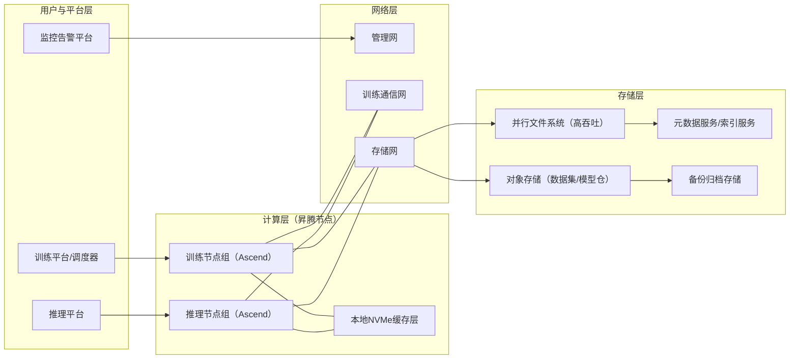
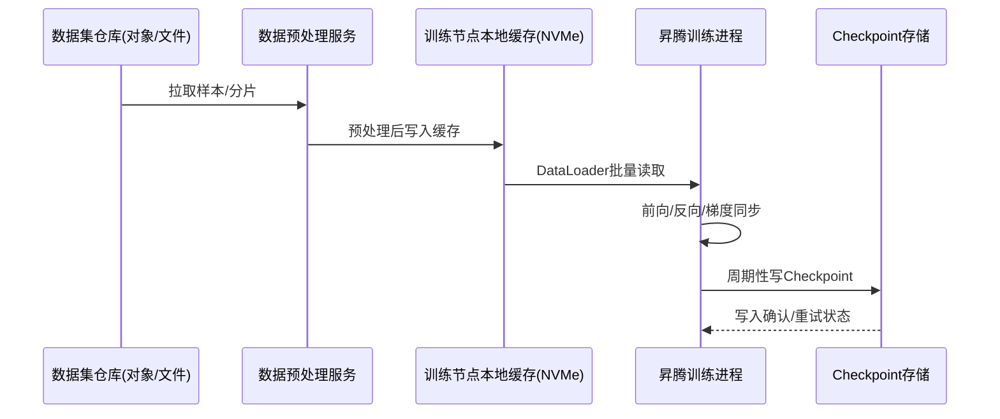
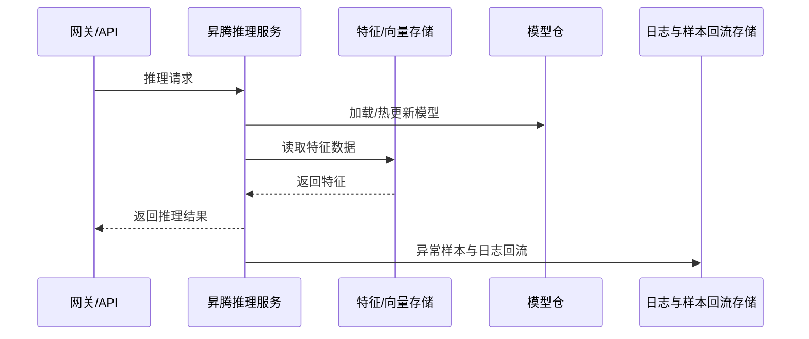
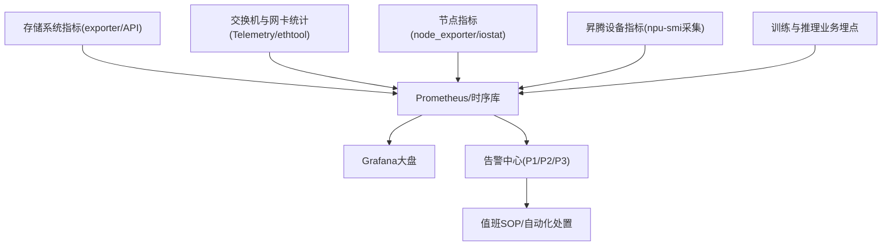

# 算力中心存储网与存储运维分享（昇腾场景）

## 1. 文档目标

本分享聚焦 4 个问题：

1. 算力中心的**存储网**和**存储系统**应如何规划。
2. 存储在**训练**与**推理**中的作用和瓶颈点。
3. 与存储交互时，关键运维指标有哪些，如何监控。
4. 以**昇腾芯片（Ascend）**为例，出现问题后如何快速排查并闭环。

---

## 2. 存储网与存储系统基础

### 2.1 为什么存储网要独立建设

在 AI 集群中，建议至少拆分三张网络：

- **管理网**：运维管理、监控、日志。
- **训练通信网**：分布式训练通信（如 HCCL 通信）。
- **存储网**：样本读取、Checkpoint 落盘、推理特征访问。

如果存储流量与训练通信混跑，常见后果是：

- AllReduce 抖动、训练 step time 波动。
- 推理实例尾延迟上升（P99/P999）。
- 存储系统端出现突发拥塞，放大到整个训练任务。

### 2.2 存储形态与典型协议

| 存储形态 | 常见用途 | 典型协议/方式 | 风险点 |
|---|---|---|---|
| 对象存储 | 数据集、模型文件、归档 | S3/OBS 接口 | 小文件多时元数据和请求放大 |
| 并行文件存储 | 训练高吞吐读写 | Lustre/GPFS/BeeGFS 等 | 元数据瓶颈、热目录 |
| 分布式块/文件 | 通用共享存储 | Ceph RBD/CephFS/NFS | 网络抖动导致时延长尾 |
| 本地 NVMe 缓存 | 热数据加速 | 本地盘 + 缓存策略 | 缓存失效与一致性策略 |

---

## 3. 拓扑图（可直接用于分享）

### 3.1 逻辑拓扑：三网分离 + 分层存储



### 3.2 物理拓扑建议（摘要）

- ToR 交换机按业务分区，存储网口建议独立队列与 QoS。
- 训练节点双网口绑定可提高可靠性（视机型和网络方案而定）。
- 存储服务节点避免与训练节点混部，减少资源争用。

---

## 4. 数据流转图：训练与推理的存储交互路径

### 4.1 训练数据流



### 4.2 推理数据流



---

## 5. 存储交互中的核心运维指标与监控方法

### 5.1 指标分层

| 层级 | 关键指标 | 监控目的 |
|---|---|---|
| 存储系统层 | 吞吐 MB/s、IOPS、读写时延 P95/P99、元数据时延、容量水位 | 判断是否是存储本身瓶颈 |
| 存储网络层 | 带宽利用率、丢包率、重传率、ECN/PFC pause、端口错误 | 判断是否为网络拥塞或链路故障 |
| 主机 I/O 层 | iowait、队列深度、磁盘 util、平均 await、文件句柄/挂载状态 | 判断节点访问存储是否异常 |
| 训练/推理层 | DataLoader wait 比例、step time、吞吐 tokens/s、推理 P99 | 判断业务影响与用户感知 |
| 昇腾设备层 | NPU 利用率、HBM 占用、任务队列等待、运行时告警 | 判断是否因数据供给不足导致 NPU 空转 |

### 5.2 重点指标清单（建议告警）

| 指标 | 现象解释 | 采集方式示例 | 告警建议 |
|---|---|---|---|
| 存储读时延 P99 | 高并发读取抖动 | 存储系统 exporter/API | 连续 5 分钟超过基线触发 P2 |
| 元数据操作时延 | 小文件场景放大 | MDS 指标/元数据服务日志 | 高于基线 2-3 倍触发 P2 |
| 存储网丢包/重传 | 影响读写稳定性 | 交换机 Telemetry + 网卡统计 | 端口连续异常触发 P1/P2 |
| 主机 iowait | I/O 堵塞信号 | node_exporter / sar / iostat | 节点级持续高位触发 P2 |
| DataLoader wait ratio | 数据供给慢 | 训练框架埋点 | 影响吞吐时触发 P2 |
| 推理 P99 延迟 | 用户体验下降 | APM/服务监控 | 超 SLA 即 P1/P2 |
| 昇腾 NPU 利用率偏低 | 可能数据喂入不足 | npu-smi + 自定义 exporter | 与 step time 联合告警 |

### 5.3 监控架构建议



---

## 6. 昇腾场景：常见问题与排查方法

### 6.1 先做三步快速判断

1. **看业务症状**：训练吞吐下降？推理 P99 变差？任务失败重试增多？  
2. **看层间相关性**：step time 抖动是否与存储时延、iowait 同步上升。  
3. **看影响范围**：单节点、单机架、全局集群，决定是否先止损隔离。  

### 6.2 场景 A：训练吞吐下降，NPU 利用率偏低

**典型表现**

- 昇腾 NPU 利用率下降，但显存占用并不低。
- step time 上升，DataLoader wait 比例上升。
- 存储读时延和主机 iowait 同时升高。

**排查路径**

```text
训练任务指标 -> 主机I/O -> 存储网络 -> 存储系统 -> 回到框架参数
```

**建议检查项**

- 训练侧：batch 读取耗时、DataLoader worker 数、prefetch 参数。
- 节点侧：`iostat -x 1`、`pidstat -d 1`、`sar -n DEV 1`。
- 网络侧：交换机端口丢包/重传、网卡 pause/drop 计数。
- 存储侧：集群健康、热点目录、元数据服务负载。
- 昇腾侧：`npu-smi info` 观察 NPU 利用率与任务状态。

### 6.3 场景 B：推理延迟 P99 抖动

**典型表现**

- 平均延迟正常，P99/P999 明显变差。
- 命中冷数据时抖动更明显。
- 模型热更新时波动扩大。

**排查路径**

1. 先确认是否为实例扩缩容与模型加载引发。  
2. 检查特征存储查询时延是否出现长尾。  
3. 检查存储网是否存在瞬时拥塞。  
4. 检查本地缓存命中率是否下降。  

**处置建议**

- 增加本地缓存预热与热点副本。
- 对模型文件拉取做限流与错峰。
- 对推理服务做存储访问超时与重试分级。

### 6.4 场景 C：任务报 I/O 错误或挂载异常

**典型表现**

- 训练任务报文件不可读、超时、I/O error。
- 节点出现挂载失效或句柄异常。

**排查顺序**

```text
挂载状态 -> 节点内核日志 -> 存储服务状态 -> 网络链路 -> 权限与配额
```

**建议动作**

- 先摘除故障节点，避免影响批量任务。
- 保留节点日志与存储侧日志，防止现场丢失。
- 修复后执行小规模回归训练再回池。

### 6.5 昇腾排查命令速查（值班常用）

| 检查目标 | 命令/方法示例 | 关注点 |
|---|---|---|
| NPU 运行状态 | `npu-smi info` | 利用率、温度、告警、任务状态 |
| 内核与 I/O 错误 | `dmesg | rg -i "i/o|blk|nvme|npu|pcie"` | 是否有硬件错误和磁盘异常 |
| 节点 I/O 压力 | `iostat -x 1`、`pidstat -d 1` | await、util、队列深度是否异常 |
| 网络健康 | `sar -n DEV 1`、`ethtool -S <网卡>` | 丢包、重传、pause、error 计数 |
| 挂载与句柄 | `mount | rg -i "nfs|ceph|lustre"`、`nfsstat -m` | 挂载参数、超时和重传配置 |
| 昇腾日志 | `/var/log/npu/`（按现场路径） | 运行时错误、驱动与框架告警 |

---

## 7. 监控落地：从“看见问题”到“自动止损”

### 7.1 推荐告警联动规则

- 规则 1：`DataLoader wait ratio` 上升 + `存储读时延 P99` 上升 -> 判定“数据供给瓶颈”。
- 规则 2：`NPU 利用率低` + `iowait 高` -> 判定“主机 I/O 受阻”。
- 规则 3：`推理 P99 上升` + `特征存储时延长尾` -> 判定“推理存储访问抖动”。

### 7.2 自动化动作建议

- 自动摘除异常节点（短时间重复 I/O 错误）。
- 自动降级任务并切换到缓存副本。
- 自动触发值班 Runbook（附检查命令与负责人）。

---

## 8. 可直接使用的汇报模板（团队分头讲）

每位成员按下面结构汇报（5 分钟）：

1. 我负责的存储域（存储系统/存储网/节点 I/O/业务埋点）。  
2. 本周期新增哪些监控指标和阈值。  
3. 发现了哪条关键故障传导链。  
4. 落地了哪些优化（缓存、限流、拓扑调整、告警联动）。  
5. 下周期计划与协同需求。  

---

## 9. 本专题交付物建议

1. 《昇腾集群存储网拓扑与分层说明（v1）》  
2. 《训练/推理存储数据流转图（v1）》  
3. 《存储交互关键指标与告警阈值表（v1）》  
4. 《昇腾场景存储故障排查 SOP（v1）》  

以上内容可直接作为内部分享材料，也可沉淀为值班与稳定性建设的标准文档。
